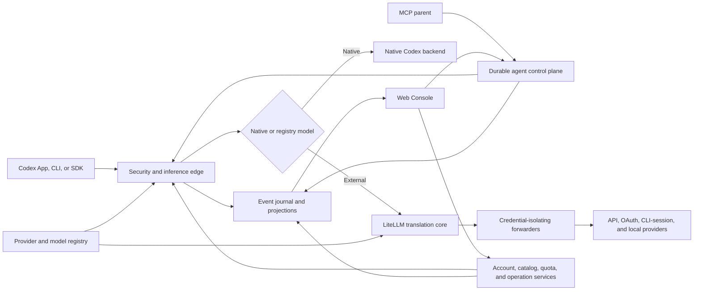

# Codex Router Platform

## Unified Product Requirements Document

| Field | Value |
| --- | --- |
| Status | Implementation-ready master draft |
| Version | 0.1 |
| Date | 2026-08-13 |
| Product | Codex Router Platform |
| Product surfaces | Agent control plane, model inference data plane, operator console, local operations |
| Primary clients | Codex App, Codex CLI, MCP-capable orchestrators, OpenAI Responses-compatible clients, browser operators |
| Deployment | Local-first, single-operator by default; trusted remote gateway optional |

Normative companion specifications:

- [Core Router PRD](PRD.md) owns logical-agent lifecycle, durability, worktree authority, handoff, and result semantics.
- [Web Console PRD](WEB_UI_PRD.md) owns the existing Console interaction, visual, accessibility, browser-transport, and lifecycle-parity contract.
- This document owns the unified platform boundary, inference and provider platform, authentication and model operations, cross-surface UI expansion, compatibility program, packaging, and total capability traceability.

Where requirements overlap, the stricter security, no-replay, credential-isolation, evidence, and accessibility requirement wins. Technical implementation may evolve without weakening a locked product decision.

## 1. Executive summary

Codex Router Platform is a local-first control and inference plane that lets an authorized operator use Codex with native and external models, supervise durable coding agents, manage providers and accounts, and diagnose the complete request path from one coherent product.

The existing repository already implements the durable agent control plane, a secure Responses-compatible inference foundation, and an operator Console. The target product completes that foundation by adopting the mature capabilities demonstrated in the bundled reference implementation under `.tmp/codex-router`: provider and model registries, LiteLLM-backed protocol translation, API-key and OAuth account flows, native Codex catalog integration, provider-specific compatibility profiles, vision and local-model support, quota and usage visibility, installation and repair workflows, and hard-earned edge-case handling.

The adoption target is **capability parity, not source-code parity**. The product must preserve every useful capability, invariant, and verified failure behavior while fitting the current event-sourced architecture. Installer code, platform shell, or compatibility workarounds may be redesigned, but no capability may disappear without an explicit traceability decision.

The central platform invariant is:

> Route only within an authorized identity boundary, preserve the selected thread and credential affinity, and never replay after semantic output or a side effect may have occurred.

### 1.1 Current baseline

At this PRD's baseline (`origin/main` at `8139848`), the repository already contains the durable MCP lifecycle, SQLite event/projection registry, worktree leases and fencing, Codex App Server and external-process adapters, secure loopback inference gateway, Responses and compact routes, Web Console, browser gateway, and regression suites described in the companion PRDs and README.

That implementation is a valid foundation, not platform completion. It does not yet establish LiteLLM-backed protocol parity, the complete provider/authentication registry, native catalog integration, compatibility profiles, model discovery/curation, OAuth and CLI-session lifecycle, vision/local-model operations, full usage/cost routing, cross-platform installer parity, or the expanded operator UI required below.

## 2. Product context and problem

Codex is more than an HTTP model client. It combines persistent agent state, tools, permissions, MCP servers, skills, model catalogs, reasoning controls, compaction, images, collaboration payloads, and account-specific native behavior. External providers expose different APIs, authentication schemes, model catalogs, reasoning controls, tool-call rules, usage reports, and operational failure modes.

A thin reverse proxy is insufficient because it cannot reliably answer:

- Which provider, account, model, protocol, and request profile should serve a request?
- Is the selected model genuinely compatible with Codex tools, reasoning, images, compaction, and collaboration?
- Which credential may cross which boundary, and how is that proven without exposing it?
- Is a retry safe, or did the first attempt already emit semantic output or initiate a side effect?
- Is an OAuth session valid, entitled, quota-limited, stale, or bound to another runtime?
- Does a catalog entry reflect current provider truth, local operator curation, or a stale cache?
- Can an operator install, authenticate, test, repair, update, and roll back the system without hand-editing private configuration?
- Can the browser explain routing and failure state without inventing success, hiding capability, or rendering secrets?

The platform must answer these questions while keeping the existing agent control plane responsive and durable.

## 3. Product vision

An operator should be able to install Codex Router once, connect any supported provider through its appropriate authentication flow, discover and validate models, expose selected models in Codex, run durable agents on them, and understand health, quota, usage, routing, and failures without leaving the Console for routine work.

The desired first-run path is:

1. Install or open the local platform.
2. Run an automatic environment and ownership preflight.
3. Connect a provider with API key, OAuth, CLI session, native Codex login, or local runtime.
4. Discover current models from the provider authority.
5. Select or curate models and review verified capabilities.
6. Run a mock compatibility suite; optionally approve a quota-consuming live probe.
7. Enable compatible models and refresh the Codex picker/catalog.
8. Start a task or use the inference endpoint.
9. Observe routing, stream state, usage, quota, and sanitized evidence.
10. Diagnose, repair, update, roll back, disable, or remove the integration safely.

## 4. Goals and success definition

### 4.1 Product goals

1. Provide one secure Responses-compatible endpoint for native and external inference.
2. Support the complete tested provider, protocol, authentication, and model capability set defined by the registry.
3. Use LiteLLM to reduce generic protocol-translation code while retaining router-owned security and replay authority.
4. Preserve native Codex model traffic and account behavior when native routing is selected.
5. Expose external models in the normal Codex catalog and picker without overwriting unrelated Codex configuration.
6. Make provider connection, model discovery, curation, validation, selection, and diagnosis available in the Console.
7. Keep every credential and OAuth session in its owning boundary; persist only references and safe projections.
8. Keep continuations on the same runtime, account, provider, model, and thread unless an explicit handoff creates a new incarnation.
9. Normalize provider incompatibilities without silently overstating model capability.
10. Make health, quota, rate limits, usage, cost, retry, and freshness observable with provenance.
11. Support local models and a governed vision bridge without pretending bridged capability is native model capability.
12. Deliver cross-platform installation, repair, migration, update, rollback, and support workflows.
13. Preserve the complete existing MCP and Web Console lifecycle capability.
14. Maintain a capability ledger proving how every relevant reference capability was adopted, superseded, deferred, or rejected.

### 4.2 Success definition

The platform succeeds when an authorized operator can connect, validate, route, supervise, and troubleshoot supported models and agents through the UI, while contract tests prove protocol correctness, credential isolation, truthful capability advertisement, durable operations, and no duplicate semantic execution.

### 4.3 Release-level success metrics

- 100% of shipped provider variants have credential-isolation, routing, catalog, normalization, failure, and UI coverage.
- 100% of listed models have documented capability provenance and a live compatibility result for required capabilities.
- 0 raw credentials, OAuth artifacts, capability URLs, or resolved secret values appear in browser DTOs, SQLite, logs, support bundles, crash reports, or tracked files.
- 0 test scenarios replay after semantic output, a command, a tool call, a file mutation, approval, or external side effect.
- 100% of mutations are idempotent, version-checked, audited, terminal-state tracked, and independently read back.
- 100% of provider setup and routine recovery workflows are possible without manual edits to managed files.
- 100% of existing agent lifecycle and narrow-viewport UI capabilities remain available.
- WCAG 2.2 AA, hosted CI, package validation, live provider probes, and visual review pass as separate gates.

## 5. Non-goals

The platform will not:

- Train or fine-tune foundation models.
- Claim compatibility solely because LiteLLM recognizes a provider or model name.
- Pool consumer subscriptions to evade provider quotas, terms, entitlements, or billing.
- Copy authentication stores between accounts or runtimes.
- Turn the browser into an OAuth callback, token exchange, secret manager, or raw provider client.
- Fabricate model availability, context size, pricing, reasoning levels, or input capabilities.
- Automatically enable every model returned by a provider catalog.
- Treat fallback to a different provider or account as transparent continuation.
- Replay a turn after semantic output or a side effect may have occurred.
- Make LiteLLM's router, retry, budget, virtual-key, database, or UI subsystems authoritative for product identity or durability.
- Expose hidden reasoning or complete private transcripts as an observability feature.
- Install system runtimes, terminate unknown services, delete retained user state, or spend provider quota without appropriate operator authority.
- Make desktop tray shells, Homebrew publication, or hosted multi-tenancy a prerequisite for core capability; those are delivery choices subject to the same product contract.

## 6. Users, roles, and jobs

### 6.1 Operator

Runs and supervises work, observes health and requests, responds to attention, and performs safe lifecycle actions within granted authority.

### 6.2 Administrator

Connects providers, manages credential references, starts login operations, curates models, changes policy, runs live probes, repairs services, and applies updates.

### 6.3 Reviewer

Inspects configuration projections, routing decisions, compatibility evidence, usage, audit events, and agent results without mutating the system.

### 6.4 Parent orchestrator

Uses MCP lifecycle tools to coordinate agents while relying on router policy for eligible runtime and model selection.

### 6.5 Codex or Responses client

Uses model-list, Responses, compaction, and supported auxiliary routes through an authenticated local inference boundary.

Role permission details inherit the Web Console PRD. Original task authority remains an independent upper bound: administrator role does not grant permission to mutate a repository, provider, or remote system beyond the initiating task.

## 7. Product principles and locked invariants

### 7.1 Event authority

Normalized runtime and platform events are appended before their projections change. Command acceptance is never displayed as completion.

### 7.2 Identity separation

The platform keeps these identities distinct:

- logical agent;
- incarnation;
- runtime;
- provider;
- provider variant;
- credential/account boundary;
- native Codex session;
- model and model revision;
- thread and turn;
- inference request and attempt;
- worktree and lease;
- authentication, catalog, install, and repair operation.

### 7.3 Credential isolation

Each request uses exactly the credential owned by its selected boundary. Client-supplied provider credentials and private Codex identity headers are stripped before external forwarding. Runtime profiles and durable records contain references only.

### 7.4 No blind replay

A request may be retried or failed over only when the router proves that no response byte conveying semantic output and no side effect has occurred. After text, reasoning, tool/function call, image, command, approval, file mutation, or other semantic event, the active attempt is final. Recovery occurs at a new explicit boundary.

### 7.5 Affinity is dominant

Context-bearing continuations retain runtime, account, provider, model, and thread affinity. A cross-boundary recovery is an explicit handoff with a new incarnation and verified hydration.

### 7.6 Capability truth

The registry states only documented and tested capabilities. A translator, vision bridge, or compatibility patch never changes what the upstream model natively supports; derived capability is labeled separately.

### 7.7 Native traffic remains native

When a native Codex model or native auxiliary route is selected, the router preserves the compatible request and response contract and forwards only allowlisted native identity headers to the hardcoded native boundary.

### 7.8 UI and CLI share authority

UI, CLI, MCP, and background services use the same application services, schemas, registry, operation model, audit journal, and redaction policy. No surface implements a private version of routing or state transition logic.

### 7.9 Unknown is not healthy

Unknown, stale, restricted, unverified, and unavailable are first-class states. They never collapse to zero usage, valid authentication, compatible capability, or healthy routing.

### 7.10 Evidence categories stay separate

Local checks, hosted CI, provider-reported usage, router-observed stream state, deployment, catalog readback, and live smoke are reported separately.

## 8. System architecture

### 8.1 Security and inference edge

The Node edge owns caller authentication, loopback binding, browser rejection, request-size and decompression bounds, route allowlisting, model dispatch, request/attempt identity, cancellation, response preflight, semantic-output observation, header filtering, error sanitization, usage observation, and no-replay decisions.

### 8.2 LiteLLM translation core

LiteLLM owns generic translation between OpenAI Responses, Chat Completions, Anthropic Messages, and other supported provider protocols. It is an internal service authenticated with a separate random capability. Its automatic retries, fallbacks, cross-deployment routing, caching, and virtual-key authority are disabled unless a later specification proves they preserve platform identity and replay invariants.

### 8.3 Credential-isolating forwarders

Forwarders remove internal and client credentials, resolve the selected credential or session at request time, apply provider-specific identity headers and request profiles, validate dynamic upstream hosts, and return sanitized health and usage signals.

### 8.4 Durable control plane

The current router remains authoritative for logical agents, runtimes, scheduling, worktrees, leases, events, continuations, handoffs, approvals, and results. The inference plane supplies model execution; it does not silently create new agent identities or migrate thread state.

### 8.5 Platform services

Platform services own provider selection, authentication operations, catalog refresh, local-model lifecycle, compatibility probes, usage aggregation, service supervision, installer transactions, updates, rollback, repair, and support bundles.

### 8.6 Web Console

The Console projects all platform state through versioned, redacted DTOs and submits durable mutations. It never contacts LiteLLM, provider endpoints, SQLite, local credential stores, or service managers directly.

## 9. Provider and model registry

### 9.1 Registry authority

The checked-in registry defines capabilities shipped to every installation. A protected user overlay defines local curation. Provider discovery is evidence, not automatic publication. The effective registry is deterministic, schema-validated, versioned, and hashable.

### 9.2 Provider contract

Each provider or protocol variant declares:

- stable ID, display name, owner, and canonical provider;
- provider kind: native, OpenAI-compatible, OAuth forwarder, CLI-session, or keyless local;
- protocol: Responses, Chat Completions, Anthropic Messages, or a narrowly defined adapter;
- base URL authority and optional environment override policy;
- credential mechanism and ordered resolution sources;
- whether a CLI requires an interactive terminal;
- discovery, health, entitlement, usage, balance, and rate-limit authorities;
- internal forwarder and request profile;
- plan or billing warning where authentication does not imply entitlement;
- local-only, experimental, catalog-only, hidden, or generally available status.

Variants sharing one credential declare that relationship explicitly. Variants may not form chains or silently use different credential sources.

### 9.3 Model contract

Each model declares:

- unique public slug, gateway ID, upstream ID, provider variant, and display metadata;
- input modalities and whether image support is native or router-derived;
- context window, compaction trigger/limit, output limits, and catalog provenance;
- supported reasoning efforts and default;
- tools, forced tool choice, parallel tools, structured output, standalone search, and collaboration compatibility;
- service tiers only when verified;
- request profile and compatibility hash;
- listed, hidden alias, deprecated, retirement, availability announcement, and recommended upgrade metadata;
- pricing source/version where usage-cost display is supported;
- latest mock and live compatibility result.

### 9.4 Validation rules

Registry loading fails for duplicate provider IDs, public slugs, gateway IDs, invalid variants, missing credential metadata, keyless non-loopback endpoints, credential-bearing URLs, incomplete picker metadata, invalid reasoning ladders, impossible defaults, or unrecognized request profiles.

A stale or colliding user overlay entry is quarantined with an operator-visible warning; it cannot prevent the router from starting.

### 9.5 Local curation

Local curation is additive by default, protected from updates, editable, and explicitly removable. It uses provider discovery for model identity but conservative defaults for unverified capabilities. A curated model is not automatically approved for native collaboration, images, tools, or production use.

### 9.6 Capability ledger

Every relevant capability found in `.tmp/codex-router` must appear in a maintained ledger with one status:

- `adopted`: implemented with equivalent or stronger behavior;
- `superseded`: replaced by a stronger architecture with equivalent acceptance evidence;
- `deferred`: assigned to a delivery phase with a blocking release gate;
- `rejected`: excluded with product, security, legal, or operational rationale.

No entry may remain `unknown` at general availability.

### 9.7 Generated artifact integrity

Registry-derived LiteLLM routes, forwarder tables, merged catalogs, aliases, agent catalogs, and managed configuration carry a shared generation/version manifest and content hashes. The running service reports the manifest it loaded. Doctor and the Console detect partial refresh, stale process state, catalog/route drift, or artifacts generated by another checkout; they never declare readiness from file presence alone.

## 10. Inference protocol contract

### 10.1 Client-facing routes

The platform supports, where the selected route is capable:

- `GET /v1/models`;
- `POST /v1/responses`;
- `POST /v1/responses/compact`;
- compatible model-capability and health routes required by supported Codex versions;
- native image generation/edit passthrough only when explicitly supported and authenticated;
- explicit protocol rejection for unsupported WebSocket or live/audio routes, with truthful client fallback behavior.

### 10.2 Request handling

The edge authenticates before decoding or logging a model payload. It accepts only allowed content types and bounded encodings, safely handles gzip, deflate, Brotli, and Zstandard when advertised, rejects ambiguous or decompression-bomb bodies, and strips browser-originated traffic.

Public model IDs are resolved through the current effective registry and enabled-provider policy. A known but disabled provider returns `provider_not_enabled`; an unknown namespaced model never falls through to native routing.

### 10.3 Streaming

Streaming preserves event order, binary bytes outside narrowly transformed fields, cancellation, and backpressure. The platform observes response events sufficiently to classify semantic output, terminal state, token usage, empty completion, and retry safety without retaining hidden reasoning or full private content.

### 10.4 Compaction

Native compaction passes through its native authority. External providers may use a router-owned, versioned compaction envelope containing an explicit continuation summary and provenance. The envelope is integrity-checked, bounded, and never presented as an upstream-native encrypted compaction artifact.

### 10.5 Collaboration payloads

Opaque native collaboration payloads are relayed or transformed only through a constrained, authenticated native authority that can open them. Login-free or unauthorized paths fail closed. Decrypted subagent tasks and handoffs never enter logs, traces, analytics, or support bundles. External plaintext stored in an `encrypted_content` field is normalized back to the native schema only when its encoding proves it is not native ciphertext.

### 10.6 Tool-result aging

Optional aging of old textual tool results is policy-controlled, transparent, measured, and limited to external-model request construction. Recent results, tool identity, errors necessary for reasoning, images, and active-turn evidence are preserved. Telemetry records bytes and estimated tokens saved. A private-fixture benchmark must prove usefulness before default changes.

## 11. Protocol translation and request profiles

### 11.1 Translation core requirements

LiteLLM must preserve:

- streaming Responses event shape;
- text, reasoning, tool/function, structured-output, and usage semantics;
- tool-call identifiers and incremental arguments;
- cancellation and error boundaries;
- input modality semantics;
- provider-specific terminal and rate-limit errors.

The platform pins the complete Python dependency closure with hashes, installs through the shipped command, starts the actual proxy in CI, verifies `/health/liveliness`, and tests supported platforms/resolvers. Lock resolution alone is not runtime proof.

### 11.2 Request-profile engine

The profile engine is model-scoped by default and declarative where possible. It supports narrow hooks for transformations that cannot be represented safely. Profiles must cover verified cases including:

- DeepSeek thinking controls, effort mapping, sampling removal, and forced-tool downgrade;
- Kimi reasoning mappings and OAuth session behavior;
- Qwen/DashScope reasoning and forced-tool restrictions;
- GLM thinking, effort, and sampling constraints;
- Gemini strict-field removal, thought-signature repair, and non-user image restrictions;
- Anthropic adaptive thinking and output-effort mapping;
- MiniMax thinking and strict tool-history requirements;
- xAI/Grok reasoning parameters and hosted-search policy;
- Ollama effort mapping and local/keyless behavior;
- provider- or model-specific automatic tool choice only when a live forced-choice probe proves it necessary.

### 11.3 Tool-history normalization

The platform may coalesce invalid consecutive assistant fragments, repair or clearly synthesize missing interrupted tool results, discard orphan tool messages that strict upstreams reject, and preserve all valid histories unchanged. Each repair is observable by count and regression-tested against the provider contract.

### 11.4 Empty-completion guard

An apparent successful response with no usable semantic content is staged within a bounded byte/time budget. A single compatible retry is allowed only before anything has been relayed and only when the request remains replay-safe. Both attempts' usage is recorded. A second empty completion becomes an explicit router error.

### 11.5 Usage correction

Provider-reported usage remains authoritative telemetry. When an explicit known-bad zero would disable Codex compaction, the response may carry a separately labeled conservative input-token estimate while stored usage retains the provider's original zero. Missing or positive counts are not overwritten.

## 12. Provider coverage program

### 12.1 Required provider families

The capability program targets all provider families represented by the bundled reference registry:

- native Codex/ChatGPT;
- OpenAI-compatible API providers;
- Anthropic Messages providers;
- Kimi API and Kimi Code OAuth;
- DeepSeek;
- Grok API and Grok CLI OAuth;
- Gemini;
- Qwen/DashScope plans;
- Z.ai/GLM Coding Plan;
- MiniMax Token Plan;
- Ollama Cloud and local Ollama;
- OpenRouter, Together, Fireworks, Groq, Cerebras, Mistral, NVIDIA NIM, SiliconFlow, Hugging Face, and Chutes;
- GitHub Copilot;
- ClinePass;
- opencode Go, Messages, Responses, and Zen variants;
- Command Code API and CLI-session delivery;
- Meta Model API;
- future providers conforming to the same contract.

This list is a parity target, not a claim that all providers are currently supported or continuously available. A provider ships only when its exact variant passes the release matrix.

### 12.2 Provider definition of done

A provider is complete only when it has:

1. validated registry entries;
2. secure credential or session resolution;
3. one-click Console and CLI onboarding;
4. model discovery or an explicit no-discovery state;
5. model curation and selection behavior;
6. translation and request-profile coverage;
7. health, entitlement, quota, rate-limit, usage, and balance projections where authoritative APIs exist;
8. text, streaming, tool, reasoning, compaction, cancellation, and failure tests;
9. image and collaboration tests when advertised;
10. doctor, install, update, support-bundle, and UI coverage;
11. documentation of billing and live-probe consequences;
12. live evidence on the exact released head before it is labeled generally available.

## 13. Authentication and account lifecycle

### 13.1 Authentication methods

Supported methods include:

- symbolic API-key or access-token references;
- protected per-user secret entry via stdin or OS credential store;
- native `codex login` inside an isolated `CODEX_HOME`;
- browser or device-code OAuth owned by an official provider CLI;
- official CLI sessions that mint or maintain an API credential;
- local keyless loopback providers.

### 13.2 Credential precedence

Precedence is explicit per provider and may include environment, protected router store, OS keychain, and declared official CLI session. Status reports source and resolution state only. A provider variant cannot silently use another variant's credential unless the registry declares the shared canonical boundary.

### 13.3 Durable authentication operations

Login, CLI installation, logout, reconnect, credential validation, and session refresh are durable operations with idempotency keys, owned processes, timeout, cancellation, events, terminal state, and independent readback. Concurrent writers to one credential boundary conflict or join the same operation.

### 13.4 Interactive CLI behavior

Official CLIs that require raw terminal mode receive a real PTY. A one-click connection operation installs the approved CLI when absent and continues directly to sign-in. The UI labels the full consequence, such as **Install & Sign In**.

### 13.5 Entitlement

Authentication does not imply provider API entitlement. The platform validates plan access where an authority exists, renders `restricted` separately from `expired` or `offline`, and shows provider plan notes before connection and live probes.

### 13.6 Native Codex accounts

Each native runtime uses its own configured `CODEX_HOME`. The router delegates authentication and credential persistence to supported Codex flows and never copies or displays `auth.json`. Native catalog and usage observations remain account-bound and cannot qualify a different runtime.

### 13.7 Logout and revocation

Logout is scoped, consequence-aware, idempotent, and read back. It cannot delete arbitrary credential paths. Invalidated accounts immediately become ineligible even if catalog, usage, or model metadata caches remain available as stale diagnostic evidence.

## 14. Native Codex integration

### 14.1 Catalog merging

The platform preserves complete native catalog objects from the installed supported Codex version and merges compatible registry models by cloning the current schema and replacing only external-model metadata. It never reconstructs native entries from a hard-coded approximation.

### 14.2 Managed configuration ownership

The config manager owns only marked router blocks and documented root fields. It preserves profiles, projects, trust, MCP, skills, features, reasoning settings, and ChatGPT authentication. Login-free mode may change provider/model only after explicit operator action, snapshots prior values, and restores them exactly when disabled.

### 14.3 Login-free mode

When supported, external models can be exposed without an OpenAI login through a dedicated local provider and safe aliases. Alias state is protected, deterministic, and cleared when native routing becomes available. An external alias never causes native credentials to be sent to an external provider.

### 14.4 Catalog freshness

Native and external catalogs are keyed by credential boundary and compatible client version, use ETag or equivalent validators when available, preserve last-known-good state as visibly stale, and never use stale authentication as routing eligibility.

### 14.5 Standalone search and auxiliary tools

Standalone web search is advertised per model only after compatibility proof. Native image and search routes remain native and credential-filtered. Unsupported routes fail explicitly rather than falling into an arbitrary external provider.

### 14.6 Codex version compatibility

The platform generates or inspects App Server and catalog protocol types from the supported Codex binary, records compatibility baselines, and blocks unsupported shapes. Compatibility cohorts are explicit rather than inferred from a user agent alone.

### 14.7 Codex tool and app parity

Routed models must receive the effective Codex tool surface required by the current supported client, including namespaced app tools that a generic OpenAI translator would otherwise flatten or omit. The platform:

- merges only allowlisted, version-compatible tool schemas;
- preserves tool descriptions and JSON Schema constraints, including integer and nested-root edge cases;
- flattens namespaces only at the translation boundary and restores namespace plus tool name on streamed and non-streamed responses before Codex dispatch;
- resolves a bare tool name only when exactly one namespace owns it;
- never advertises a tool the current client cannot dispatch;
- rejects stale, unknown, ambiguous, or invented tool names;
- keeps browser/computer-use/app-thread tool availability distinct from model-native capability.

Schema, namespace, and app-tool compatibility is version-keyed and contract-tested against the supported Codex client. Tool compatibility cannot be inferred from a successful text response.

### 14.8 Routed collaboration and agent catalog

Native collaboration v1 remains the conservative default. A model is advertised for native v2 subagent overrides only after it proves encrypted-payload relay, forced tool/function behavior, marker-return spawn, cancellation, and same-thread follow-up. Operator selection controls whether only registry-approved models or additional individually selected models enter the routed agent catalog; picker visibility and subagent visibility remain separate policies.

Generated agent catalogs and managed concurrency settings are schema- and version-aware. Unsupported Codex builds receive neither an unknown feature flag nor catalog metadata they cannot interpret.

### 14.9 Managed capability pack

The platform may install a small, versioned Codex skill pack for router-specific capabilities such as app threads, in-app browser use, and computer use. Installation records per-skill ownership tokens, never overwrites foreign or modified skills, removes only verified router-owned content, and treats skill failure as a diagnosable optional degradation rather than grounds to roll back inference.

The Console exposes pack version, freshness, ownership conflicts, required-client capability, install/update/uninstall actions, and exact affected paths without rendering skill contents as trusted provider data.

### 14.10 Compatible clients

Codex App and CLI are normative clients. Other Responses-compatible applications may be supported only through an explicit compatibility profile covering authentication, catalog behavior, routes, tools, streaming, and restart requirements. Compatibility is never inferred from sharing the OpenAI SDK. Client-specific workarounds cannot weaken the primary Codex contract.

## 15. Routing, health, quota, and failover

### 15.1 Eligibility

New requests filter by enabled state, provider/model availability, credential validity, entitlement, capability, project authority, worktree mode, protocol, client compatibility, concurrency, health, quota, and explicit request constraints.

### 15.2 Scoring

Eligible candidates are scored by continuation affinity, explicit preferences, capability fit, quota headroom, health, load, project locality, priority, and least-recently-used policy. Every decision records candidates, rejections, score reasons, policy version, catalog version, quota snapshot version, and selected identity boundaries.

### 15.3 Health and quota states

The platform represents ready, degraded, draining, critical, exhausted, limited, offline, restricted, and unknown states. Thresholds and hysteresis are operator policy, not provider guarantees. Sparse updates merge without erasing newer complete windows.

### 15.4 Safe retry

Bounded transport retries are allowed only before response commitment and only for failures that prove no origin execution or semantic response, such as selected connect-level failures and configured intermediary statuses. `429`, ordinary `4xx`, origin `500`, mid-stream disconnects, and long-running timeouts are not automatically replayed.

### 15.5 Safe failover

Cross-account or cross-provider failover is legal only for a new, replayable request before semantic output. A small bounded SSE preflight may classify the stream. Once semantic content appears, failover stops. Context-bearing continuation uses explicit handoff rather than request replay.

### 15.6 Cancellation

Client disconnect, agent cancel, service shutdown, and timeout propagate abort signals through edge, LiteLLM, and forwarder. Cancellation is observed separately from provider failure and does not trigger fallback.

## 16. Vision and multimodal bridge

### 16.1 Capability semantics

A text-only model may receive router-derived image transcripts, but its registry modalities remain text-only. The catalog advertises derived image handling only while a configured engine actually resolves, and the UI labels it **via vision bridge**.

### 16.2 Engine sources

An engine may be:

- a selected and credentialed registry vision model using the normal gateway;
- an explicitly pinned local loopback model;
- a native Codex vision model using the current caller's live native session.

Auto mode excludes unreachable or keyless loopback engines. Native engines introduce no new credential and fail closed without a live caller session.

### 16.3 Operator control

Never-configured, explicitly enabled, explicitly disabled, and unreadable-state cases remain distinguishable. Installer and updates do not silently enable quota-spending behavior. Downloads require explicit consent and run as observable background operations.

### 16.4 Transcript integrity

Every image-shaped part in user messages and tool outputs is handled. Transcripts identify the originating file or tool request, record the engine used and completeness, deduplicate the same image within and across concurrent requests, and maintain an append-only bounded evidence record per image.

### 16.5 Failure and fallback

Transient engine failures may use a bounded retry/fallback policy that is never silent and never violates an explicit pin. A pinned local engine cannot spend an unselected cloud provider's quota. Incomplete transcripts say why and do not invite infinite rereads.

### 16.6 Local vision quality

Local vision engines receive measured benchmark labels only. Unmeasured engines remain `untested`; plausible but inaccurate output cannot earn a high ranking through reputation or model naming.

## 17. Local models

### 17.1 Local provider

The local provider is keyless, loopback-only, and experimental until repeatable agent compatibility is proven. Local models live in the user overlay, never the checked-in global registry.

### 17.2 Discovery and lifecycle

The platform detects supported Ollama or compatible runtimes, inspects installed and remote model metadata, separates select, download, unselect, and delete, and never downloads or removes multi-gigabyte artifacts without explicit consent.

### 17.3 Capability validation

Template or provider metadata is a filter, not proof. A local model is eligible for Codex agent use only after real tool-call, streaming, cancellation, context, and repeated agent checks. Image input is advertised only when the family and live endpoint support it.

### 17.4 Progress and recovery

Downloads are durable background operations with progress, cancellation where supported, restart recovery, and partial-state cleanup. A model is enabled only after the runtime proves it is installed and routable.

## 18. Model discovery and compatibility program

### 18.1 Discovery

Discovery calls the provider's official catalog authority with the selected credential boundary and compares current IDs to checked-in and locally curated state. It is read-only and does not publish or enable models.

### 18.2 Capability matrix

Compatibility is recorded independently for:

- text, non-streaming, and streaming;
- reasoning and each advertised effort;
- tool calls, forced tool choice, parallel tools, and argument streaming;
- structured output;
- image input and image tool-result history;
- long context and compaction;
- standalone search result history;
- cancellation and disconnect;
- native collaboration spawn and same-thread follow-up;
- usage and rate-limit observation.

### 18.3 Probe policy

Mock probes run automatically. Live probes show provider, model, expected capability, quota/billing consequence, and request count before an administrator authorizes them. Results are attached to the exact model/profile/registry hash and expire when relevant inputs change.

### 18.4 Publication states

Models progress through discovered, curated, mock-compatible, live-compatible, experimental, listed, deprecated, and retired states. Listing requires the capabilities claimed in the picker, not every optional capability.

## 19. Usage, limits, cost, and observability

### 19.1 Request record

Each request records safe identity and timing metadata:

- request and attempt IDs;
- caller class, runtime, provider, account reference ID, model, and profile hash;
- start, upstream connect, first semantic output, and terminal times;
- status, error class, cancellation, retry/failover count, and semantic-output boundary;
- provider-reported input, output, cached, and reasoning tokens;
- separately labeled estimates and substitutions;
- compaction, tool-result aging, vision, and compatibility flags.

Prompts, hidden reasoning, tool payloads, OAuth material, and provider response bodies are excluded by default.

### 19.2 Quota and balance

Authoritative provider endpoints and normalized rate-limit headers feed separate quota, plan, balance, and rolling-window projections. Unavailable metrics render unavailable, never zero. Every snapshot names its source and freshness.

### 19.3 Cost

Cost is computed only when versioned pricing provenance exists. Provider invoice truth and router estimates remain distinct. The UI can aggregate by provider, account, model, project, agent, and time range without exposing secret identity.

### 19.4 Logs and support bundles

Structured logs use redacted identifiers and bounded errors. Never-quiet reliability events include retries, fallbacks, credential-source changes, vision-engine fallback, empty completion, token substitution, and service repair. Support bundles default to local creation, list every included file, remove capabilities and secrets, and are never uploaded automatically.

## 20. Web Console product expansion

### 20.1 Information architecture

The existing Console expands to these primary areas:

- **Overview** — platform readiness, active agents, inference traffic, provider health, attention, and updates.
- **Agents** — existing lifecycle, worktree, handoff, evidence, and result surfaces.
- **Providers** — registry variants, connection methods, entitlement, health, enablement, and setup.
- **Accounts** — native and external account boundaries, login state, quota, affinity, operations, and logout.
- **Models** — authoritative catalog, curation, capability matrix, compatibility, picker visibility, defaults, and upgrades.
- **Routing** — policy, aliases, affinity, alternatives, capability tiers, and decision explanations.
- **Requests** — live and historical sanitized request timelines, streams, attempts, usage, and errors.
- **Usage** — tokens, estimates, costs, quotas, balances, and reset windows.
- **Local Models** — runtime status, discover, inspect, download, validate, select, and remove.
- **Diagnostics** — service graph, ports, dependency locks, catalog drift, credential resolution, doctor, repair, support bundle, and update state.
- **Settings** — network, retention, bridge, compaction, tool aging, collaboration, managed config, and role policy.

### 20.2 Provider onboarding workflow

The UI must support:

1. choose provider or auto-detect configured providers;
2. review endpoint, authentication, plan, and privacy consequences;
3. enter a permitted symbolic reference or launch a server-owned secure/official login flow;
4. install an approved official CLI when needed;
5. independently read back authentication and entitlement;
6. discover models;
7. select or curate models;
8. run compatibility probes;
9. enable the provider and models;
10. refresh/read back the Codex catalog and service routes.

The workflow is resumable across browser reload and router restart.

### 20.3 Model workbench

The model workbench shows public/upstream IDs, provider variant, availability, provenance, context, modalities, reasoning ladder, tools, search, compaction, collaboration, pricing, compatibility evidence, picker state, and local overrides. Unsupported and router-derived capabilities are visually distinct.

### 20.4 Request inspector

The inspector shows the routing decision, identity boundaries, profile transformations by category, attempt timeline, semantic-output boundary, status, usage, and sanitized failures. It does not render prompt bodies, hidden reasoning, decrypted collaboration payloads, raw provider bodies, or credentials.

### 20.5 Diagnostics and repair

The Console runs read-only doctor checks by default. Repair presents the exact owned layers it will change, takes a snapshot, executes a durable operation, restores on failure where possible, and readbacks every layer. It never kills an unknown process or edits an unowned configuration block.

### 20.6 Design and accessibility

The Web Console PRD's Quiet Operations Desk direction, complete mobile capability, restrained motion, reduced-motion behavior, keyboard operation, screen-reader semantics, and WCAG 2.2 AA gate remain normative. Provider logos never become the only identity or state signal. Dense matrices use progressive disclosure without hiding consequences.

### 20.7 Optional desktop companion

An optional platform-native tray or menu-bar companion may provide start-at-login, follow-Codex-presence, health/usage reminders, pause/resume, update notification, and **Open Console** shortcuts. It is a thin client of the same local application service and owns no provider, routing, credential, or catalog logic. All setup and recovery capability remains available in the responsive Web Console and CLI.

## 21. Browser API and realtime contract

### 21.1 Resource families

The browser application service adds versioned resources for providers, accounts, models, catalogs, compatibility runs, inference requests, usage, local-model operations, platform operations, service health, install/update state, and capability-ledger status.

### 21.2 Mutations

All mutations require role authorization, original authority, idempotency key, expected resource/config version, CSRF/Origin protection, audit actor, operation resource, terminal event, and authoritative readback. Long-running work returns `202` with an operation ID.

### 21.3 Realtime

Resumable SSE remains the browser default. Events are projection notifications, not secret-bearing raw provider streams. Cursor gaps force a redacted snapshot refresh. Offline mutations are disabled and never queued in the browser.

### 21.4 Secret entry

The Web Console never receives a raw API key. **Set credential** starts a durable local operation that either validates a symbolic reference or opens a server-owned native secure prompt/PTY outside the browser; the browser observes only pending, stored, failed, and read-back authentication state. Headless operators use the equivalent fixed CLI stdin prompt. The value never enters browser requests, general application DTOs, operation payloads, command arguments, logs, crash reporting, analytics, replay tooling, or SQLite. No surface can reveal an existing value.

## 22. Installation, service, migration, and updates

### 22.1 Supported hosts

The target is current-user installation on supported macOS, Linux, and Windows environments. WSL/Desktop bridging is supported only with an explicit compatibility contract and filesystem/path translation tests.

### 22.2 Installer transaction

Installation:

1. checks platform, Codex, Git, Node, Python/`uv`, ownership, ports, and filesystem permissions;
2. uses a stable checkout and dedicated state root;
3. detects known legacy installations read-only;
4. snapshots owned Codex config and router state;
5. installs exact Node and hash-locked Python dependencies;
6. generates registry, LiteLLM, service, catalog, and managed config artifacts;
7. installs a current-user service;
8. starts and probes each layer;
9. runs doctor and independent readback;
10. leaves the final Codex restart to the operator unless a UI-initiated mode switch explicitly owns a graceful restart.

Unknown routers, services, processes, and config blocks are never replaced automatically.

### 22.3 Python supply chain

The LiteLLM lock is universal across supported platforms, contains the full transitive closure and hashes, respects security floors, avoids source builds where supported wheels exist, and is tested by actual installation through every shipped resolver. CI starts the installed proxy; import metadata and dependency resolution are insufficient.

### 22.4 Doctor and repair

Doctor checks ownership, permissions, config markers, capability secrecy, caller/internal keys, registry, catalog/routes parity, provider credentials, OAuth/CLI state, LiteLLM boot, forwarders, ports, service, local runtime, version compatibility, dependency integrity, retention/log rotation, and loaded generation manifest. `--fix` or UI repair changes only managed layers and produces a before/after report.

Install, repair, update, catalog refresh, provider connection, and local-model mutation use scoped operation locks. A second process joins, waits, or fails with the owning operation; it never writes the same state concurrently.

### 22.5 Update and rollback

Updates are transactional, preserve user overlays and unrelated Codex state, refresh generated artifacts, run migrations and health checks, and retain a rollback target. Failure restores the previous runnable version or leaves an explicit attention state with recovery instructions. Tagged artifacts include checksums and provenance attestations.

### 22.6 Disable and uninstall

Disable restores managed Codex routing while preserving retained state. Uninstall removes only manifest-owned services, files, and config markers; retained credentials, backups, logs, and model downloads require separate explicit choices. Material deletion reports recoverability.

## 23. Security and privacy

### 23.1 Network boundaries

Built-in gateways bind to loopback. Remote deployments require authenticated TLS termination, trusted identity propagation, role mapping, and explicit threat review. No CORS wildcard or public capability URL is permitted.

### 23.2 Internal capabilities

Caller-to-edge, edge-to-LiteLLM, and LiteLLM-to-forwarder capabilities are independent random secrets stored with current-user-only permissions. Capability-bearing paths and internal headers are treated as secrets and redacted everywhere.

### 23.3 Header and destination policy

Each route uses a positive header allowlist or a constructed header set. Dynamic provider destinations are HTTPS and registry-owned; dynamic account-discovered hosts require vendor allowlisting and anti-redirect validation. Keyless providers are loopback-only.

### 23.4 Files and permissions

Protected state, credentials, snapshots, aliases, catalogs containing capability paths, and operation artifacts use restrictive current-user permissions. Symlinks, ownership changes, broad roots, and foreign manifests fail closed.

### 23.5 Content privacy

Prompt bodies, images, tool results, repository data, decrypted collaboration payloads, and provider response bodies are processed only as needed for the selected route. They are not used for analytics or support bundles. Retention is explicit, minimal, and independently configurable from operational event retention.

### 23.6 Threat model minimums

Security review covers SSRF, credential confused deputy, OAuth token theft, browser exfiltration, malicious provider errors, decompression bombs, request smuggling, header injection, cross-runtime logout, stale catalog eligibility, dependency compromise, local service impersonation, support-bundle leakage, and replay after partial response.

## 24. Edge-case and failure contract

The release suite must cover at least:

- malformed, truncated, mislabeled, and fragmented SSE;
- empty completion before and after staged response budget;
- disconnect before headers, after headers, after reasoning, after text, during tool arguments, and after tool call;
- malformed JSON/tool arguments and duplicated or missing tool events;
- consecutive assistant fragments, orphan tool results, interrupted tool runs, and compacted histories;
- missing/invalid Gemini thought signatures and non-user image parts;
- context overflow, compaction failure, corrupt router envelope, and truthful zero usage;
- `400`, `401`, `403`, `404`, `409`, `429`, `5xx`, intermediary failures, timeout, redirect, TLS failure, DNS failure, and client cancellation;
- expired OAuth, failed refresh, revoked session, restricted plan, catalog endpoint drift, and dynamic-host rejection;
- credential rotation and logout during active requests;
- catalog refresh failure, stale cache, model removal, alias collision, and user-overlay collision;
- router, LiteLLM, forwarder, browser, and OS restart during request, login, download, install, and update operations;
- duplicate idempotency keys, stale versions, concurrent account writers, and lost operation responses;
- local runtime absent, model partially downloaded, tool capability advertised but not functional, and model removal while selected;
- same image repeated in a turn and across concurrent requests;
- native/external collaboration payloads in both directions;
- namespace flattening/restoration, ambiguous bare tool names, malformed integer arguments, and client tool-schema drift;
- managed skill collisions, locally modified managed skills, stale ownership manifests, and unsupported client capability packs;
- support-bundle, logs, metrics, UI DTOs, and error responses containing seeded canary secrets;
- unknown processes holding managed ports;
- rollback after partial dependency, service, config, or migration application.

Every failure maps to a structured class, safe operator message, retry/handoff eligibility, audit evidence, and recovery action. Raw exceptions are not the network contract.

## 25. Non-functional requirements

### 25.1 Responsiveness

- Agent start remains bounded as defined in the core PRD.
- Inference streaming adds no avoidable full-response buffering.
- Console shell becomes interactive within the Web Console PRD budget.
- Provider and catalog network operations are background operations with progress, not blocking page requests.

### 25.2 Reliability

- Router restart reconciles durable operations and active agents.
- Service supervision uses bounded backoff and avoids restart storms.
- Last-known-good catalog and configuration survive failed refresh/apply.
- One broken provider, user overlay, or local runtime cannot prevent unrelated providers and native agents from operating.

### 25.3 Scalability

The local reference target supports at least 100 logical agents, 20 active turns, 100 configured models, 50 provider variants, 10 credential boundaries, and 10,000 retained request summaries without violating responsiveness budgets. Actual provider concurrency remains externally governed.

### 25.4 Compatibility

Supported Node, Python, Codex, OS, architecture, and provider API versions are explicit. A compatibility matrix distinguishes source support, local test support, package support, and live verification.

### 25.5 Accessibility

All routine and recovery workflows meet WCAG 2.2 AA and remain complete with keyboard, screen reader, 200% zoom, forced colors, reduced motion, touch, and narrow viewport.

## 26. Verification strategy

### 26.1 Unit tests

Schemas, registry validation, profiles, header filters, secret resolution, retry predicates, semantic-output classification, usage parsing, cost calculation, catalog merge, state machines, and UI projections.

### 26.2 Contract tests

Strict mock servers for Responses, Chat Completions, Anthropic Messages, OAuth/CLI sessions, catalog, health, rate limits, usage, local runtimes, LiteLLM, App Server, and browser APIs. Mocks assert exact model IDs and forbidden headers as well as expected output.

### 26.3 Golden protocol fixtures

Versioned fixtures cover streaming text, reasoning, tools, images, structured output, compaction, collaboration, usage, errors, and malformed frames. Binary and compressed payloads are included.

### 26.4 Integration tests

Boot the actual Node edge, pinned LiteLLM environment, forwarders, database, and strict mock providers. Verify cancellation, backpressure, service startup, configuration generation, catalog/routes parity, and restart reconciliation.

### 26.5 Chaos and race tests

Kill or disconnect each layer at every meaningful boundary; rotate credentials, expire sessions, overlap operations, corrupt caches, occupy ports, lose responses, and restart during writes. Assert no duplicate semantic work and no cross-boundary credential use.

### 26.6 UI tests

Component, accessibility, browser contract, full workflow E2E, visual regression, reduced motion, responsive capability parity, offline behavior, and secret-canary inspection.

### 26.7 Cross-platform installation tests

Install from clean state and upgrade from each supported predecessor on macOS, Linux, Windows, and documented WSL configurations. Verify both `uv` and `pip` Python install paths where shipped.

### 26.8 Live provider matrix

Live tests use dedicated authorized accounts, explicit quota approval, exact released artifacts, and no credentials in CI logs or repository state. Evidence records provider/model/profile hash, test time, result, and limitations. Passing mocks never substitute for live provider proof.

### 26.9 Evidence gates

Report separately:

- worktree and commit state;
- focused and full local verification;
- actual LiteLLM boot and dependency-lock proof;
- packaged artifact inspection;
- hosted CI;
- security and accessibility review;
- provider catalog/readback;
- live compatibility probes;
- install/update/rollback tests;
- deployment and live health if deployed.

## 27. Delivery program

Every phase is a vertical slice with backend, UI, tests, docs, migration, diagnostics, and rollback. A backend-only phase is incomplete unless explicitly labeled a non-production spike.

### Phase 0: Capability ledger and architecture baseline

- Freeze reference capability inventory.
- Define registry, operation, request, usage, and browser DTO schemas.
- Threat model Node/LiteLLM/forwarder boundaries.
- Prototype Providers, Accounts, Models, Requests, Usage, and Diagnostics screens.
- Establish Python lock and actual-proxy CI.

Exit gate: every reference capability has an owner/status and no unresolved identity or secret boundary.

### Phase 1: Translation foundation

- Integrate pinned LiteLLM behind the existing secure inference edge.
- Add internal capabilities and shared API forwarder.
- Support Responses, Chat Completions, and Anthropic Messages.
- Add registry-generated routes and no-replay/empty-completion guards.
- Ship read-only provider/model/request UI.

Exit gate: strict mocks prove streaming, tools, reasoning, credential isolation, cancellation, and no replay.

### Phase 2: API-key provider parity

- Implement registry and profiles for API-key and catalog-only provider families.
- Add secure secret entry/reference flows, discovery, curation, selection, compatibility, usage, and UI onboarding.
- Merge external models into the Codex catalog.

Exit gate: each listed provider passes its definition of done and routine setup requires no config editing.

### Phase 3: OAuth, CLI sessions, and native accounts

- Implement isolated Codex login/status/logout.
- Implement Kimi and Grok OAuth, Copilot validation, Command Code and other official CLI-session flows.
- Add account, entitlement, quota, login-operation, and recovery UI.

Exit gate: cross-account isolation, expiry, concurrent login, restart, logout consequence, and readback tests pass.

### Phase 4: Compatibility and context parity

- Complete provider request profiles, tool-history repair, compaction, token substitution, tool-result aging, standalone search, and collaboration relay.
- Ship capability workbench and request-inspector transformation evidence.

Exit gate: the full compatibility matrix passes for every advertised capability, including native collaboration probes.

### Phase 5: Vision and local models

- Implement governed vision bridge, transcript cache/evidence, engine fallback, local runtime discovery, downloads, benchmarks, and agent checks.
- Ship Local Models and Vision settings/workflows.

Exit gate: no image-shaped input leaks to text-only upstreams, duplicate purchases are prevented, and local capability claims are measured.

### Phase 6: Intelligent routing, usage, and cost

- Add health cache, rate-limit parsing, quota hysteresis, account affinity, safe pre-output failover, usage aggregation, and versioned cost estimates.
- Ship routing policy, decisions, usage, quota, balance, and cost UI.

Exit gate: failure injection proves eligibility and failover without duplicate semantic output or affinity violation.

### Phase 7: Installation and operations parity

- Deliver guided installer, services, doctor/fix, migration, support bundle, updates, rollback, disable, uninstall, and cross-platform packaging.
- Ship first-run, diagnostics, repair, update, and rollback UI.

Exit gate: clean install, upgrade, rollback, and repair pass on all supported hosts through released artifacts.

### Phase 8: General availability hardening

- Complete security, privacy, accessibility, load, chaos, visual, supply-chain, and live-provider reviews.
- Close every capability-ledger item.
- Publish operational documentation, compatibility matrix, provenance, and rollback support.

Exit gate: every Definition of Done item has exact-head evidence.

## 28. Capability adoption matrix

This initial matrix is normative in scope and must become file/symbol-level during Phase 0.

| Reference capability family | Target disposition | Owning phase | Release evidence |
| --- | --- | --- | --- |
| Split provider/model registry and user overlays | Adopt | 0-2 | Schema, collision, overlay, and catalog tests |
| LiteLLM protocol translation | Adopt behind stronger edge | 1 | Hash-locked install, actual boot, streaming/tool contracts |
| Native/external dispatcher and catalog merge | Adopt | 1-2 | Codex-version fixtures and picker smoke |
| API credential forwarder and header isolation | Adopt | 1-2 | Canary-secret and strict-header tests |
| Kimi/Grok OAuth and CLI session refresh | Adopt | 3 | Expiry, reconnect, PTY, and readback tests |
| GitHub Copilot dynamic endpoint validation | Adopt | 3 | Entitlement and host-allowlist tests |
| Request-profile normalization | Adopt and generalize | 2-4 | Provider matrix and exact-body assertions |
| Compaction and router-owned summary envelope | Adopt | 4 | Corruption, boundary, and long-context tests |
| Routed collaboration payload relay | Adopt with fail-closed boundary | 4 | Real spawn plus follow-up probes |
| Namespace relay, app-tool schema completion, and argument repair | Adopt | 4 | Generated-schema and streamed/non-streamed tool tests |
| Routed agent catalog and multi-agent v1/v2 controls | Adopt conservatively | 4 | Spawn, override, concurrency, and stale-client tests |
| Router-managed Codex skill pack | Adopt as owned optional capability | 4-7 | Ownership, collision, update, and uninstall tests |
| Compatible-app profiles | Adopt only when explicitly proven | 4-7 | Per-client catalog, route, tool, and stream matrix |
| Empty-completion guard | Adopt | 1-4 | Staging, retry, usage, and double-empty tests |
| Tool-result aging | Adopt behind benchmark/policy | 4 | A/B benchmark and semantic-retention tests |
| Prompt-token zero substitution | Adopt narrowly | 4 | Byte-preservation and provenance tests |
| Vision bridge and transcript deduplication | Adopt | 5 | E2E image/tool/concurrency tests |
| Local model discovery/download/benchmark | Adopt as experimental | 5 | Download recovery and repeated agent checks |
| Rate-limit, quota, balance, and usage state | Adopt | 6 | Source/freshness/hysteresis tests |
| Pre-output retry/failover | Supersede with event-aware policy | 6 | Partial-stream and side-effect chaos tests |
| Guided install, doctor, repair, migration | Adopt | 7 | Cross-platform install/upgrade tests |
| Service supervision, update, rollback | Adopt | 7 | Fault-injected artifact tests |
| Tray/provider control panels | Supersede with Web Console first | 2-7 | Complete responsive UI workflows; optional thin tray |
| Presence-aware tray lifecycle and usage reminders | Supersede with optional thin companion | 6-7 | Shared-service state and notification tests |
| Generated-artifact ownership, signing/hash, and drift detection | Adopt and generalize | 0-7 | Manifest, foreign-checkout, partial-refresh, and stale-process tests |
| Homebrew formula and release artifacts | Defer to packaging decision | 7 | Artifact, checksum, provenance tests |
| Reference code layout and fixed ports | Reject as authority | 0 | Architecture decision and compatibility mapping |

## 29. Risks and mitigations

| Risk | Impact | Mitigation |
| --- | --- | --- |
| Scope becomes an unreviewable rewrite | Long-lived instability | Vertical slices, capability ledger, atomic migrations, exact acceptance gates |
| LiteLLM changes behavior or dependency graph | Translation or supply-chain regression | Exact pins/hashes, actual boot CI, golden fixtures, edge-owned safety |
| Provider API drift | Silent incompatibility | Dynamic discovery, compatibility hashes, live matrix, fail-closed catalog |
| Duplicate output or side effects | Corrupted conversations or repositories | Semantic-output state machine, bounded preflight, no mid-stream replay |
| OAuth or CLI integration leaks secrets | Account compromise | Official flows, owned processes, PTY where needed, no raw DTOs/logs |
| UI and backend diverge | Unsafe or misleading operations | Shared application service and operation model |
| Stale catalog or quota state routes incorrectly | Wrong model/account selection | Freshness, invalid-auth override, explicit unknown, recorded decisions |
| Compatibility patches become unmaintainable | Provider regressions | Model-scoped profiles, schema validation, exact-body fixtures, limited hooks |
| Local/vision feature spends unexpected quota | Cost or privacy surprise | Explicit engine/source labels, policy, consent, usage events, pin semantics |
| Installer damages existing Codex state | Loss of configuration or trust | Marked ownership, snapshots, transaction, rollback, readback |
| “All providers” is mistaken for permanent availability | False product promise | Coverage program and live evidence, not static marketing claims |

## 30. Locked product decisions

1. The product unifies durable agent control and model inference without conflating their identities.
2. Capability parity with the bundled reference is required; source-code parity is not.
3. The secure Node edge remains authoritative for authentication, dispatch, cancellation, observability, and replay safety.
4. LiteLLM is the generic translation core, not the authority for identity, routing durability, retry, credentials, or UI.
5. Automatic LiteLLM retries and fallbacks are disabled unless the edge explicitly authorizes a replayable attempt.
6. Provider credentials and native Codex sessions never cross credential boundaries.
7. Continuations retain runtime, account, provider, model, and thread affinity.
8. Cross-boundary recovery creates a new incarnation and explicit handoff.
9. Native Codex traffic and auxiliary routes remain native when selected.
10. Registry capabilities are documented and tested; model names do not imply capability.
11. Provider discovery never auto-publishes or auto-enables models.
12. UI, CLI, MCP, and services share the same application authority.
13. Routine provider/model/auth/diagnostic operations require no manual managed-file edits.
14. OAuth callbacks and credential stores remain owned by supported runtimes or official provider CLIs, not the browser gateway.
15. Unknown, stale, restricted, experimental, and router-derived states remain visible and distinct.
16. The vision bridge never changes native model modality claims.
17. Local models remain experimental until repeatable agent behavior is proven.
18. Live compatibility and quota-consuming tests require explicit authority.
19. Installation, repair, update, rollback, and uninstall mutate only manifest-owned state.
20. Web Console capability ships with each vertical slice; UI is not postponed until backend completion.
21. The Console remains a quiet operations desk, not a generic AI dashboard or chat wrapper.
22. No capability-ledger entry may remain unknown at general availability.
23. Local verification, package proof, hosted CI, live provider evidence, deployment, and health remain separate claims.

## 31. Intentionally deferred technical choices

These choices require design or implementation evidence and may not weaken the locked behavior:

- single process versus supervised Node/LiteLLM/forwarder processes;
- exact Python environment manager and bundled-runtime strategy per platform;
- exact protected secret-store backend beyond the required boundary;
- whether an optional native tray is retained as a thin shortcut to the Web Console;
- exact pricing data source and update mechanism;
- exact database retention and aggregation scheme for high-volume request summaries;
- WebSocket support after protocol and replay-safety self-tests;
- remote multi-user deployment topology;
- Homebrew core, winget, or other distribution channels;
- additional protocol families such as audio/realtime after explicit product scope.

## 32. Definition of Done

### 32.1 Product completeness

- Every required provider family is implemented or carries an explicit post-GA rejection/defer decision approved against the capability ledger.
- All routine setup, validation, routing, supervision, diagnosis, recovery, and removal workflows exist in the Console and CLI.
- Existing agent lifecycle and evidence capability remains complete.
- All empty, partial, stale, restricted, unavailable, experimental, offline, and error states are designed.

### 32.2 Correctness and reliability

- No duplicate semantic output or side effect occurs in the full retry/failover/transport chaos matrix.
- Continuation and handoff identity rules hold under restart, quota exhaustion, and credential failure.
- Catalog, route table, registry, managed Codex config, and selected model read back consistently.
- Actual LiteLLM and provider forwarders boot and pass contract tests from the released artifact.

### 32.3 Provider compatibility

- Every listed model passes its advertised capability matrix on the exact registry/profile hash.
- Every provider passes credential isolation, entitlement, health, error, usage, and onboarding requirements.
- Live evidence is current enough for release policy and limitations are visible.

### 32.4 Security and privacy

- Threat model and independent security review are complete.
- Seeded secrets remain absent from persistence, logs, network errors, UI, support bundles, and artifacts.
- Login/logout, dynamic hosts, browser requests, file permissions, and cross-runtime boundaries pass adversarial tests.
- Dependency locks, checksums, provenance, and vulnerability floors pass.

### 32.5 UI and accessibility

- Web Console routes and workflows pass lifecycle, provider, model, request, usage, local-model, diagnostics, and recovery E2E tests.
- WCAG 2.2 AA, keyboard, screen reader, forced colors, zoom, reduced motion, touch, and narrow viewport pass.
- Visual and motion craft review approves the full regression matrix.

### 32.6 Delivery and operations

- Clean install, recognized migration, update, failed update rollback, repair, disable, and uninstall pass on every supported host.
- Hosted CI is green on the exact reviewed head.
- Packaged artifacts are independently inspected and attested.
- Operator documentation covers setup, privacy, quota, provider limitations, troubleshooting, rollback, and support bundles.

No individual test suite, provider smoke, automated score, or local run substitutes for the complete evidence set.
