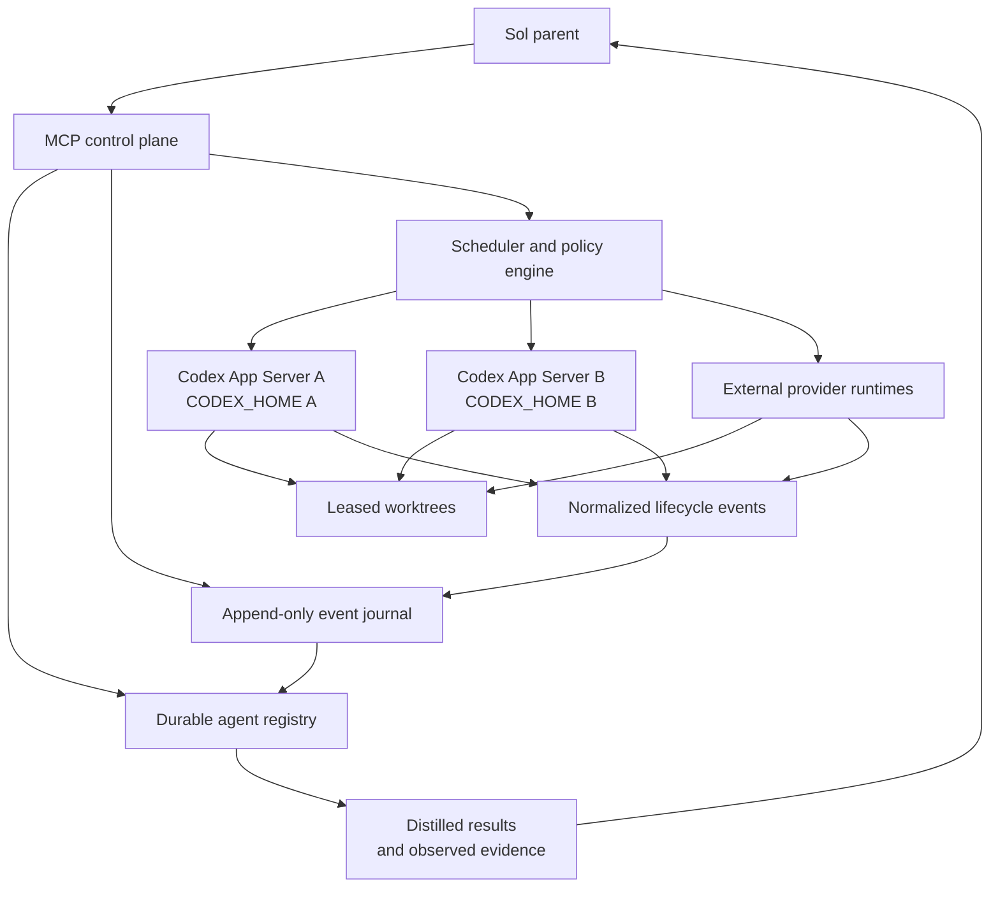

# Codex Router

## Product Requirements Document

| Field | Value |
| --- | --- |
| Status | Implementation-ready draft |
| Version | 0.1 |
| Date | 2026-08-13 |
| Product | Codex Router |
| Primary interface | MCP control plane |
| Execution backends | Codex App Server runtimes and external provider runtimes |
| Primary orchestrator | Sol or another MCP-capable parent agent |

Companion specification: [Codex Router Console Web UI PRD](WEB_UI_PRD.md).

## 1. Executive summary

Codex Router is a durable control plane for starting, observing, steering, continuing, cancelling, and moving long-running coding agents across execution runtimes.

The router must not implement a long-running agent as one blocking MCP invocation that launches a process, waits for tens of minutes, and returns a large stdout payload. That design prevents the parent agent from coordinating parallel work, steering an active worker, recovering after transport failure, or preserving a useful context budget.

Instead, an MCP call creates or controls a logical agent and returns promptly. Actual work runs inside persistent Codex App Server threads or an equivalent external runtime. Lifecycle events are consumed asynchronously and projected into a durable registry. A parent agent can then start multiple workers, wait for any or all of them, steer active turns, continue completed threads, cancel work, request a handoff, and retrieve distilled results without ingesting the worker's complete transcript.

The central product invariant is:

> Agent identity is durable; execution context is replaceable; the worktree and verified task state are authoritative.

Codex Router is intended for authorized accounts, workspaces, providers, repositories, and tasks. It is not intended to pool subscription accounts to evade provider limits or entitlements.

## 2. Problem statement

Large coding tasks routinely take longer than a normal synchronous tool call and may consume hundreds of tool calls, large repository reads, multiple test runs, and substantial model context. A parent agent coordinating this work needs to remain responsive while workers run.

A naive MCP bridge creates the following problems:

- `agent_start` blocks until the worker finishes.
- MCP or reverse-proxy timeouts can orphan successful work.
- The parent cannot steer or stop the worker while it is running.
- Parallelism requires parallel blocking calls and fragile client behavior.
- A completed worker's entire transcript or stdout consumes the parent's context.
- Runtime, account, model, thread, task, and worktree identity become conflated.
- A rate limit or runtime failure can destroy conversational continuity and obscure partially completed repository changes.
- Retried MCP requests can accidentally start duplicate workers.
- Router restarts can lose the mapping between a worker and its App Server thread.

Codex App Server already supplies the core execution primitives for Codex-backed workers: persistent threads, turns, lifecycle notifications, active-turn steering, interruption, structured terminal errors, account state, and rate-limit updates. Codex Router must build a reliable compatibility and orchestration layer around those primitives rather than recreate an agent runtime.

## 3. Product vision

A Sol parent should be able to coordinate a heterogeneous worker fleet as naturally as native subagents while retaining explicit control over routing, credentials, durability, and recovery.

The target interaction is:

```text
Sol parent
  |
  |-- agent_start(task A, tier=principal) --> pro-17
  |-- agent_start(task B, tier=senior)    --> pro-18
  |-- agent_start(task C, tier=worker)    --> flash-31
  |
  |-- agent_wait([pro-17, pro-18], any)
  |<-- pro-18 completed
  |
  |-- agent_steer(pro-17, "Do not change the canonical schema")
  |-- agent_result(pro-18)
  |<-- distilled result plus observed evidence
  |
  |-- agent_continue(pro-18, "Fix the two failing round-trip tests")
```

The parent stays responsible for architecture, authority, integration, and final decisions. Workers supply bounded execution and evidence.

## 4. Goals

### 4.1 Product goals

1. Return promptly from agent creation without waiting for task completion.
2. Run multiple independent agents concurrently across eligible runtimes.
3. Preserve conversation continuity for follow-up work on the same runtime and thread.
4. Support active-turn steering and interruption through native runtime primitives.
5. Provide event-driven `any` and `all` waiting without polling the model.
6. Keep agent, incarnation, runtime, thread, turn, task, and worktree identities separate.
7. Persist enough state to reconcile workers after router or transport restarts.
8. Route authorized work using capability, affinity, health, quota, load, and policy.
9. Recover from usage limits and runtime failures without blindly replaying side effects.
10. Preserve repository work through clean or explicitly marked unclean handoffs.
11. Return compact, structured results supported by independently observed evidence.
12. Isolate credentials by runtime and never expose credentials to model prompts.

### 4.2 Success definition

Codex Router succeeds when a parent can safely operate a long-running, parallel worker fleet while receiving only the architectural findings and verified engineering evidence it needs.

## 5. Non-goals

Codex Router v1 will not:

- Train, fine-tune, or host foundation models.
- Replace Codex App Server's thread or turn execution engine.
- Migrate an active ChatGPT-authenticated thread across different account boundaries.
- Treat model self-report as proof that files changed or tests passed.
- Automatically push, merge, release, deploy, or alter remote systems unless the task explicitly authorizes those actions.
- Copy `auth.json`, access tokens, API keys, or refresh tokens between runtime boundaries.
- Pool consumer subscriptions for the purpose of bypassing account limits or provider entitlements.
- Guarantee safe replay after semantic output or external side effects have occurred.
- Stream every reasoning token, terminal line, or worker transcript to the parent by default.
- Use voting among workers as a substitute for evidence and architectural judgment.
- Provide a multi-tenant hosted control plane in the first release.
- Create a general-purpose workflow language in the first release.

## 6. Users and primary jobs

### 6.1 Parent orchestrator

Usually Sol or another MCP-capable lead agent.

Primary jobs:

- Decompose a large objective into independent tasks.
- Select a capability tier or an exact runtime when necessary.
- Start several workers without blocking.
- Monitor status and wait for useful completion boundaries.
- Steer workers when new constraints or evidence appear.
- Continue a worker using the same context.
- Stop unsafe or obsolete work.
- Request a planned handoff before quota exhaustion.
- Consume distilled results and make final decisions.

### 6.2 Operator

The person responsible for local runtimes, credentials, worktrees, and policies.

Primary jobs:

- Register authorized runtime profiles.
- Observe runtime health, load, and quota state.
- Configure routing and recovery policies.
- Diagnose stuck, failed, or lost agents.
- Audit which runtime, account, model, and worktree executed a task.
- Rotate credentials without exposing them to agents.

### 6.3 Worker agent

A Codex App Server thread or external-provider execution session performing a bounded task.

Primary jobs:

- Inspect the actual repository state.
- Follow the supplied objective and invariants.
- Modify only authorized files and systems.
- Produce test evidence and explicit risks.
- Accept steering, interruption, or follow-up instructions.
- Produce a concise final report.

## 7. Product principles and invariants

These rules are normative.

### 7.1 Asynchronous control plane

`agent_start` acknowledges creation and initial turn acceptance; it never waits for the worker's final answer.

### 7.2 Durable state hierarchy

The sources of truth, from most authoritative to least authoritative, are:

1. Actual filesystem, Git, process, database, and remote-system state.
2. Router-observed runtime events and command results.
3. Durable router registry and event journal.
4. Structured handoff/checkpoint documents.
5. Worker-authored summaries.

The worker summary is useful context, not proof.

### 7.3 Identity separation

```text
logical agent != incarnation != runtime != thread != turn != worktree
```

- A logical agent represents a durable task relationship exposed to the parent.
- An incarnation represents one execution attempt on one runtime.
- A runtime represents one credential and provider boundary.
- A thread represents conversation continuity inside a compatible runtime.
- A turn represents one active or completed unit of model execution.
- A worktree represents durable repository state protected by a writer lease.

### 7.4 Runtime affinity

Follow-up turns remain on the existing runtime and thread whenever that runtime is healthy and policy permits it. Routing must not use blind round-robin for context-bearing work.

### 7.5 No magical cross-account resume

`thread/resume` reopens a stored thread within its compatible Codex state and credential boundary. Cross-account or cross-provider recovery creates a new incarnation and hydrates it from verified handoff state.

### 7.6 Single writer

At most one live incarnation may hold the writer lease for a worktree. A handoff must quiesce or explicitly fence the previous writer before the new incarnation edits.

### 7.7 No blind replay

Once semantic model output, filesystem mutation, command execution, or an external side effect is observed, the router must not replay the original turn automatically as if nothing happened.

### 7.8 Authority does not expand

Routing or failover never grants a worker more permission than the parent task supplied. A new incarnation inherits the same or a narrower authority envelope.

### 7.9 Credentials stay outside prompts

Credentials are injected only through runtime process configuration or provider adapters. Credential values must not be persisted in task records, events, prompts, results, or normal logs.

### 7.10 Terminal state is event-confirmed

A successful interrupt request is not a completed cancellation. The router changes an incarnation to `interrupted` only after the runtime emits or reconciliation proves the terminal state.

## 8. Terminology and domain model

### 8.1 Logical agent

The stable identifier returned to the parent, such as `kernel-review-4`. It survives multiple turns and runtime incarnations.

### 8.2 Incarnation

One attempt to execute the logical agent on a selected runtime. A usage-limit handoff from Sol A to Sol B ends incarnation 1 and starts incarnation 2.

### 8.3 Runtime

An eligible execution target with its own provider, model catalog, credential boundary, process connection, limits, and health.

Examples:

- Codex App Server using `CODEX_HOME=/.../sol-primary`.
- Codex App Server using `CODEX_HOME=/.../sol-review`.
- An API-backed OpenAI worker runtime.
- A DeepSeek Pro runtime.
- A DeepSeek Flash runtime.

### 8.4 Thread

A persistent conversation owned by a compatible runtime. A thread may contain several turns and can be resumed after being unloaded or after the App Server restarts.

### 8.5 Worktree

The repository directory in which a worker executes. It may be a Git worktree, clone, or explicitly registered repository directory. Its state is durable independently of model context.

### 8.6 Checkpoint

A verified snapshot of task and engineering state used for recovery or handoff. A checkpoint is either `clean` or `unclean`.

### 8.7 Result

A compact product-facing record containing worker-reported conclusions and router-observed evidence.

## 9. System overview



### 9.1 Components

#### MCP server

Exposes the bounded parent-facing tool contract. It validates authorization, idempotency, expected state, and request shape before issuing a command.

#### Agent registry

Stores current projections for agents, incarnations, runtimes, worktrees, pending interactions, checkpoints, and results.

#### Event journal

Stores append-only normalized events before updating projections. It allows deterministic reconciliation, debugging, and rebuilding of registry state.

#### Runtime supervisor

Starts or connects to App Servers, completes protocol initialization, monitors connection health, and normalizes backend events.

#### Scheduler

Filters eligible targets and chooses a runtime using hard constraints followed by affinity, quota, load, and cost policy.

#### Worktree lease manager

Provides exclusive writer leases with fencing tokens. It prevents an old or duplicated router process from continuing to mutate a reassigned worktree.

#### Result distiller

Combines the final worker report with router-observed files, commands, tests, decisions, risks, and terminal state.

## 10. MCP product surface

The v1 surface contains nine core lifecycle tools plus one restricted pending-interaction response tool. Names may be namespaced by the MCP server but their semantics are stable.

### 10.1 `agent_start`

Creates a logical agent, allocates a runtime, creates a thread, starts the initial turn, and returns without waiting for completion.

Request:

```ts
type AgentStartRequest = {
  idempotencyKey: string;
  task: string;
  projectKey: string;
  worktree: {
    path: string;
    mode: "write" | "read_only";
  };
  routing?: {
    capabilityTier?: "architect" | "principal" | "senior" | "worker";
    preferredRuntimeId?: string;
    allowedRuntimeIds?: string[];
    provider?: "openai" | "deepseek" | string;
    model?: string;
  };
  authority?: {
    allowPush?: boolean;
    allowMerge?: boolean;
    allowDeploy?: boolean;
    allowExternalWrites?: boolean;
  };
  recoveryPolicy?: "manual" | "wait_for_reset" | "auto_handoff_if_clean";
  labels?: Record<string, string>;
};
```

Response:

```ts
type AgentStartResponse = {
  agentId: string;
  status: "queued" | "starting" | "running" | "needs_attention";
  registryVersion: number;
  incarnation?: {
    id: string;
    runtimeId: string;
    threadId?: string;
    turnId?: string;
  };
};
```

Requirements:

- The same `idempotencyKey` and equivalent payload return the same logical agent.
- Reusing the key with a conflicting payload returns an idempotency conflict.
- The call returns after `turn/start` is accepted or the task is durably queued.
- It must not wait for `turn/completed`.
- A write-mode request must acquire the worktree lease before starting a mutating turn.
- A read-only task may share a worktree only when runtime permissions also enforce read-only access.

### 10.2 `agent_status`

Returns the current logical-agent projection, active incarnation, pending interaction, recovery state, and concise progress.

Request:

```ts
type AgentStatusRequest = {
  agentId: string;
  includeHistory?: boolean;
};
```

Response includes:

- Logical status and registry version.
- Active runtime, thread, and turn identifiers.
- Incarnation history when requested.
- Last durable lifecycle event.
- Whether semantic output or side effects have been observed.
- Pending approval or user-input request.
- Current checkpoint quality.
- Last known runtime health and quota state.

### 10.3 `agent_list`

Lists agents visible to the caller.

Supported filters:

- Status.
- Project.
- Worktree.
- Runtime.
- Capability tier.
- Label.
- Creation or update cursor.

The response is paginated and does not include full transcripts.

### 10.4 `agent_wait`

Waits on registry events, not model polling.

Request:

```ts
type AgentWaitRequest = {
  ids: string[];
  mode: "any" | "all";
  timeoutMs: number;
  afterVersion?: number;
  wakeOn?: Array<"terminal" | "needs_attention" | "handoff" | "status_change">;
};
```

Response:

```ts
type AgentWaitResponse = {
  satisfied: boolean;
  timedOut: boolean;
  registryVersion: number;
  agents: Array<{
    agentId: string;
    status: AgentStatus;
    changed: boolean;
    terminal: boolean;
    needsAttention: boolean;
  }>;
};
```

Requirements:

- A condition already satisfied returns immediately.
- `afterVersion` prevents missed wakeups after reconnect or retry.
- Timeout returns current state rather than throwing an execution failure.
- The server sets a configurable maximum wait duration and callers may repeat waits.
- `mode: "all"` evaluates the requested wake condition for every selected agent.

### 10.5 `agent_steer`

Adds instructions to the active regular turn.

Request:

```ts
type AgentSteerRequest = {
  agentId: string;
  idempotencyKey: string;
  input: string;
  expectedIncarnationId?: string;
  expectedTurnId?: string;
};
```

Requirements:

- For Codex runtimes, map to `turn/steer` with the active thread and expected turn.
- Reject stale requests when expected identifiers do not match.
- Reject steering when no turn is active.
- Return a structured `not_steerable` state for review or compaction turns.
- Record the steer as an event without treating acceptance as proof that the worker obeyed it.

### 10.6 `agent_continue`

Starts a new turn on the same logical agent after the previous turn reaches a valid boundary.

Request:

```ts
type AgentContinueRequest = {
  agentId: string;
  idempotencyKey: string;
  input: string;
  expectedResultVersion?: number;
};
```

Requirements:

- Prefer the existing runtime and thread.
- If the thread is unloaded, resume it before starting the turn.
- Do not route a continuation to another runtime implicitly.
- If the original runtime is unavailable, return `handoff_required`, `waiting_for_reset`, or a policy-specific recovery state.
- Reject concurrent continuations for the same logical agent.
- A completed logical agent may transition back to `running` while retaining its prior result versions.

### 10.7 `agent_cancel`

Requests interruption of the active turn.

Request:

```ts
type AgentCancelRequest = {
  agentId: string;
  idempotencyKey: string;
  expectedTurnId?: string;
  cleanBackgroundTerminals?: boolean;
};
```

Requirements:

- Map to native turn interruption when available.
- Transition first to `cancelling`.
- Transition to `interrupted` only after a terminal event or successful reconciliation.
- Background terminal cleanup is explicit because turn interruption alone may not terminate them.
- Repeated cancel calls are idempotent.

### 10.8 `agent_handoff`

Moves a logical agent to a new execution incarnation while preserving its task identity and verified worktree state.

Request:

```ts
type AgentHandoffRequest = {
  agentId: string;
  idempotencyKey: string;
  targetRuntimeId?: string;
  reason: "planned" | "quota" | "runtime_failure" | "operator_request";
  additionalInstruction?: string;
  allowUnclean?: boolean;
};
```

Requirements:

- Stop accepting new continuation commands for the old incarnation.
- Attempt to quiesce the active turn.
- Wait for terminal confirmation when the runtime remains reachable.
- Inspect background terminals and actual worktree state.
- Create a clean or unclean checkpoint.
- Release or fence the old writer lease.
- Select an eligible target under the original authority envelope.
- Start a new thread and incarnation.
- Require the new worker to inspect the actual worktree before editing.
- Preserve complete incarnation history.
- Never claim conversation migration across credential boundaries.

### 10.9 `agent_result`

Returns a compact, versioned result without returning the full transcript by default.

Request:

```ts
type AgentResultRequest = {
  agentId: string;
  version?: number;
  detail?: "summary" | "evidence" | "debug";
};
```

Summary response:

```ts
type AgentResult = {
  agentId: string;
  resultVersion: number;
  status: "completed" | "failed" | "interrupted" | "partial";
  reported: {
    summary: string;
    decisions: string[];
    invariants: string[];
    risks: string[];
    pending: string[];
  };
  observed: {
    runtimeId: string;
    model?: string;
    headSha?: string;
    baseSha?: string;
    changedFiles: string[];
    worktreeStatus: string;
    tests: Array<{
      command: string;
      exitCode: number | null;
      outcome: "passed" | "failed" | "interrupted" | "unknown";
      summary?: string;
    }>;
    terminalError?: {
      class: string;
      message: string;
    };
  };
  incarnationHistory: Array<{
    incarnationId: string;
    runtimeId: string;
    terminalReason?: string;
  }>;
};
```

`detail: "debug"` is operator-oriented, access-controlled, paginated, and still redacts credentials.

### 10.10 Pending interaction response

App Server can issue approval or user-input requests while a turn is active. A control plane without a response path can deadlock.

V1 therefore also exposes a restricted interaction tool:

```ts
type AgentRespondRequest = {
  agentId: string;
  interactionId: string;
  idempotencyKey: string;
  response:
    | { type: "approval"; decision: "approve_once" | "deny" }
    | { type: "user_input"; input: string };
};
```

The router must not auto-approve requests merely because a worker was started. It evaluates the interaction against the original authority envelope and configured approval policy.

## 11. Agent lifecycle

### 11.1 Logical agent states

```ts
type AgentStatus =
  | "queued"
  | "starting"
  | "running"
  | "needs_attention"
  | "cancelling"
  | "handing_off"
  | "waiting_for_reset"
  | "completed"
  | "failed"
  | "interrupted";
```

### 11.2 Incarnation states

```ts
type IncarnationStatus =
  | "allocating"
  | "thread_ready"
  | "turn_running"
  | "quiescing"
  | "completed"
  | "failed"
  | "interrupted"
  | "lost";
```

### 11.3 Valid transitions

```text
queued -> starting -> running
running -> needs_attention -> running
running -> cancelling -> interrupted
running -> handing_off -> starting -> running
running -> waiting_for_reset -> starting -> running
running -> completed
running -> failed
completed -> starting -> running          # agent_continue
failed -> handing_off -> starting         # explicit or policy-gated recovery
interrupted -> starting -> running         # explicit continuation
```

Invalid or stale transitions return a conflict containing current status and registry version.

### 11.4 Terminal semantics

- `completed`: the most recent turn completed and a result version exists.
- `failed`: the most recent incarnation ended with an unrecovered failure.
- `interrupted`: a cancellation reached a confirmed terminal state.
- `partial`: a result classification used when work exists but the objective did not complete; it is not an additional logical-agent state.

## 12. Runtime lifecycle and account isolation

### 12.1 Runtime states

```ts
type RuntimeState =
  | "ready"
  | "busy"
  | "draining"
  | "limited"
  | "degraded"
  | "offline";
```

### 12.2 Codex runtime isolation

Each ChatGPT or Codex credential boundary runs in a separate App Server process with a dedicated `CODEX_HOME`.

```text
runtime sol-main
  CODEX_HOME=/secure/codex-runtimes/sol-main

runtime sol-review
  CODEX_HOME=/secure/codex-runtimes/sol-review
```

The router must not repeatedly log one shared App Server in and out to switch accounts.

### 12.3 Runtime registration

A runtime profile contains:

```ts
type RuntimeProfile = {
  id: string;
  adapter: "codex_app_server" | "external_provider";
  provider: string;
  capabilityTiers: Array<"architect" | "principal" | "senior" | "worker">;
  allowedModels: string[];
  maxConcurrency: number;
  codexHomeRef?: string;
  credentialRef?: string;
  policyTags: string[];
  enabled: boolean;
};
```

`codexHomeRef` and `credentialRef` identify secure configuration; normal API responses must not reveal their resolved secret values.

### 12.4 Runtime health

Health considers:

- Process and transport availability.
- Successful App Server initialization.
- Account/authentication state.
- Model availability.
- Current concurrency.
- Rate-limit snapshots and updates.
- Recent failure rate.
- Event-stream lag.
- Ability to acquire the requested worktree mode.

## 13. Routing and scheduling

### 13.1 Eligibility filters

Before scoring, a runtime must satisfy all hard constraints:

- Runtime is enabled and authorized for the caller and project.
- Provider and model match explicit request constraints.
- Capability tier is supported.
- Credential is valid.
- Runtime is not `limited` or `offline`.
- Concurrency capacity exists or queueing is allowed.
- Required filesystem and network permissions can be enforced.
- Worktree lease requirements can be met.
- The target does not broaden the task's authority.

### 13.2 Scoring order

Eligible targets are ranked in this order:

1. Existing agent/thread affinity.
2. Explicit preferred runtime.
3. Project and architecture affinity.
4. Quota headroom and reset horizon.
5. Current and predicted concurrency.
6. Runtime reliability.
7. Capability fit.
8. Cost and latency policy.

The exact score weights are configuration, but the reasons for a routing decision must be recorded.

### 13.3 Draining policy

Quota thresholds are operator policy, not provider guarantees.

The default policy may classify a runtime as:

- `ready`: accepts eligible new and affine work.
- `draining`: rejects new long tasks but may keep affine active work and small follow-ups.
- `limited`: accepts no new turns until recovery criteria are met.

Classification should use more than `usedPercent`:

- Primary and secondary quota window usage.
- Window duration and reset time.
- Backend-classified reached-limit type.
- Spend-control state where available.
- Historical burn rate.
- Estimated task size.
- Existing active turns.

### 13.4 Routing observability

Every allocation records:

- Candidate runtimes considered.
- Hard-constraint rejection reasons.
- Selected runtime.
- Affinity decision.
- Quota snapshot version.
- Policy version.

Credential data must be redacted.

## 14. Waiting and event model

### 14.1 Event ingestion

For Codex App Server, the adapter consumes lifecycle notifications including:

```text
thread/started
thread/status/changed
turn/started
item/started
item/completed
turn/diff/updated
error
turn/completed
account/updated
account/rateLimits/updated
```

Provider-specific events are normalized into router events.

### 14.2 Event journal requirements

- Append the normalized event before applying its projection.
- Assign a monotonic router sequence number.
- Store backend identifiers needed for deduplication.
- Tolerate duplicate and out-of-order delivery where the backend permits it.
- Preserve terminal events indefinitely or according to explicit retention policy.
- Redact secret-bearing fields before persistence.

### 14.3 Registry versions

Each projection update increments a registry version. `agent_wait(afterVersion)` uses this value to prevent missed notifications between status reads and waits.

### 14.4 Backpressure

High-volume deltas and shell output must not overwhelm durable state.

- Terminal lifecycle and mutation evidence are lossless.
- High-volume text deltas may be compacted or retained in bounded debug storage.
- Final `item/completed`, command exit codes, file-change records, and turn terminal events are durable.
- Parent-facing responses contain summaries and references rather than full logs.

## 15. Persistence, idempotency, and reconciliation

### 15.1 Required durable records

The router persists:

- Logical agents.
- Incarnations.
- Runtime profiles and health projections.
- Runtime thread and turn identifiers.
- Worktree registrations and leases.
- Idempotency records.
- Normalized event journal.
- Checkpoints.
- Pending interactions.
- Result versions.
- Routing and policy decisions.

### 15.2 Command idempotency

All mutating MCP tools require an idempotency key. A record stores:

- Caller scope.
- Tool name.
- Normalized request hash.
- Operation state.
- Result or conflict.
- Created and expiry timestamps.

The implementation must handle the critical window where a backend accepts a command but the MCP response is lost.

### 15.3 Start reconciliation

If the router cannot prove whether `thread/start` or `turn/start` succeeded, it must reconcile before retrying. It may use stored client metadata, thread lists, thread reads, active-turn state, or provider-specific correlation identifiers.

It must not create a second worker merely because the first response was lost.

### 15.4 Router restart reconciliation

On startup:

1. Load nonterminal agents and runtime connections.
2. Reconnect or restart runtime supervisors.
3. Query known threads and active turns.
4. Replay missing terminal or status state into the journal.
5. Mark an incarnation `lost` only after bounded reconciliation fails.
6. Preserve worktree leases until fenced, expired, or explicitly recovered.
7. Wake relevant waiters with the reconciled registry version.

### 15.5 Lease fencing

Each write lease carries a monotonically increasing fencing token. The active incarnation includes the token in its local execution boundary. A superseded router or incarnation cannot renew or reuse an older token.

## 16. Worktree ownership and checkpointing

### 16.1 Worktree registration

V1 accepts an existing absolute worktree path. Managed worktree creation may be added later. Registration records:

- Canonical path.
- Repository identity.
- Current HEAD.
- Base/upstream reference when available.
- Dirty state at registration.
- Read or write mode.
- Owning agent and fencing token.

Pre-existing user changes must be preserved and distinguished from worker changes where possible.

### 16.2 Clean checkpoint

A clean checkpoint requires:

- Previous active turn reached a terminal state.
- Background terminals were inspected and no process is expected to keep mutating the worktree.
- Writer lease is controlled by the router.
- Git status and diffs were read from the actual filesystem.
- Untracked-file manifest was captured.
- Current HEAD and base SHA were recorded.
- Completed command and test evidence was summarized.
- Completed, pending, and risky work was recorded.

### 16.3 Unclean checkpoint

An unclean checkpoint is used when a runtime disappears or cannot be quiesced.

It must record:

- Why cleanliness could not be proven.
- Last observed turn and event.
- Possible live processes or external effects.
- Filesystem snapshot time.
- Required verification steps for the new incarnation.

Automatic handoff from an unclean checkpoint is disabled by default.

### 16.4 Handoff hydration

The new incarnation receives:

- Original task and authority envelope.
- Original invariants and all subsequent steering constraints.
- Verified completed and pending work.
- Current worktree path and checkpoint metadata.
- Known failing and passing tests.
- Decisions and risks.
- An explicit instruction to inspect actual state before editing.

It does not receive secrets or a claim that the old conversation was migrated.

## 17. Failure handling and recovery

### 17.1 Failure classes

The router normalizes failures into:

```ts
type FailureClass =
  | "usage_limit"
  | "authentication"
  | "provider_unavailable"
  | "transport_disconnected"
  | "context_window"
  | "session_budget"
  | "permission_denied"
  | "approval_timeout"
  | "runtime_crash"
  | "worktree_conflict"
  | "cancelled"
  | "unknown";
```

### 17.2 Usage limit during a turn

When a Codex turn fails with structured `UsageLimitExceeded`:

1. Mark the runtime `limited` or `draining` according to the latest account state.
2. Record the turn terminal error.
3. Preserve and inspect the worktree.
4. Determine whether semantic output or side effects occurred.
5. Create a checkpoint.
6. Apply the logical agent's recovery policy.

Policies:

- `manual`: return `failed` or `needs_attention` with available recovery actions.
- `wait_for_reset`: set `waiting_for_reset`, retain runtime/thread affinity, and resume after reset.
- `auto_handoff_if_clean`: hand off only if a clean checkpoint and an authorized eligible runtime exist.

### 17.3 Same-runtime recovery

Preferred when urgency is low and conversation continuity is valuable:

```text
usage limit
  -> waiting_for_reset
  -> reset confirmed
  -> thread/resume if needed
  -> turn/start with recovery instruction
```

### 17.4 Cross-runtime recovery

Used when work must continue promptly:

```text
old incarnation terminal or fenced
  -> checkpoint
  -> select target
  -> new thread
  -> inspect actual worktree
  -> continue task
```

The new worker must not simply replay the original instruction without acknowledging partial work.

### 17.5 Transport disconnect

A disconnected event stream does not automatically mean the turn failed. The router enters reconciliation and asks the runtime for actual thread/turn state before classifying the incarnation.

### 17.6 Provider retry safety

Automatic retry is permitted only when the router can prove all of the following:

- No semantic output was delivered.
- No command, file mutation, dynamic tool, approval, or external side effect began.
- The provider declares the failure retryable.
- The idempotency record still owns the operation.

Otherwise the router reconciles or hands off.

## 18. Result distillation and context protection

### 18.1 Default result contract

The parent receives:

- Outcome and concise summary.
- Changed-file list.
- Preserved invariants.
- Decisions made.
- Observed test commands and outcomes.
- Pending work.
- Risks.
- Incarnation/failover summary.
- References for optional deeper evidence.

### 18.2 Evidence separation

The result UI and API must label:

- `reported`: claims produced by the worker.
- `observed`: facts recorded by the router or read from actual state.
- `unverified`: claims for which the router lacks independent evidence.

### 18.3 Transcript policy

- Full worker chatter is excluded by default.
- Raw reasoning is not required for product correctness.
- Command output is summarized, with bounded logs available to operators.
- Large diffs are referenced by artifact or filesystem path rather than embedded in the parent response.
- Results are versioned so follow-up turns do not overwrite earlier evidence.

## 19. Approval and attention handling

### 19.1 Attention state

An agent enters `needs_attention` when execution cannot safely continue without a decision, including:

- Command or file approval request.
- User input request.
- Routing policy conflict.
- Unclean handoff requiring authorization.
- Missing runtime eligibility.
- Worktree ownership conflict.

### 19.2 Wait behavior

`agent_wait` can wake on `needs_attention` independently of terminal completion. This prevents an approval request from looking like a merely slow worker.

### 19.3 Approval invariants

- The router never upgrades authority during approval handling.
- A denied request is recorded and returned to the worker/runtime.
- Approval requests expire according to policy and become visible as attention failures.
- Approval responses are idempotent and correlated to one pending interaction.
- Credentials and secret values are redacted from approval text and logs.

## 20. Security, authorization, and policy

### 20.1 Credential security

- Credential files use restrictive filesystem permissions.
- Runtime processes receive only their configured credential boundary.
- Normal application logs never contain tokens or `auth.json` content.
- Secret values are redacted before events enter the journal.
- Router APIs return runtime IDs, not secret paths or values.
- Credentials are never copied for failover.

### 20.2 Authorized account use

Every runtime profile must be explicitly registered as authorized. Routing may use several accounts or workspaces only when their use complies with ownership, workspace policy, and provider terms.

The product must not market or implement subscription-limit circumvention as a scheduling objective. For scalable programmatic workload, API-backed provider runtimes are the preferred execution target.

### 20.3 Repository authority

The start request carries an authority envelope. Default values are false for push, merge, deploy, and external writes. A handoff cannot broaden these fields.

### 20.4 Path security

- Worktree paths must be absolute and within configured allowed roots.
- Broad roots such as `/` or a user home directory are not valid write worktrees.
- Symlink resolution and canonical paths are checked before lease acquisition.
- Runtime sandbox/permission policy must match requested worktree mode.

### 20.5 Auditability

The system records who or what requested:

- Agent creation.
- Steering.
- Continuation.
- Approval.
- Cancellation.
- Handoff.
- Runtime or policy changes.

## 21. Observability

### 21.1 Operator views

The system must expose:

- Agent swarm list and status.
- Runtime health, concurrency, quota, and reset state.
- Active thread and turn ownership.
- Worktree leases and fencing tokens.
- Pending attention requests.
- Handoff and incarnation history.
- Recent structured failures.
- Event ingestion lag.

### 21.2 Required metrics

- Agent starts by runtime and status.
- Start acknowledgement latency.
- Running, queued, and attention-blocked agents.
- Turn completion duration and outcome.
- Steering acceptance/rejection count.
- Wait duration and timeout count.
- Runtime utilization and drain duration.
- Usage-limit failure count.
- Same-runtime and cross-runtime recovery outcomes.
- Handoff duration and clean/unclean ratio.
- Duplicate command suppression count.
- Reconciliation count and lost-incarnation count.
- Result payload size relative to retained worker events.

### 21.3 Structured logs

Every log line must contain relevant correlation fields:

```text
agent_id
incarnation_id
runtime_id
thread_id
turn_id
operation_id
registry_version
```

Secret values and raw credentials are forbidden.

## 22. Non-functional requirements

### 22.1 Responsiveness

- With a ready runtime, `agent_start` p95 acknowledgement should be under 3 seconds, excluding explicit queueing.
- Status reads should be local registry operations with p95 under 200 ms.
- A satisfied wait should return within 500 ms of the durable registry update under normal local load.

### 22.2 Durability

- An acknowledged mutating request must survive router restart.
- Terminal turn events, idempotency records, checkpoints, and results must be durable.
- Router restart must not knowingly create a duplicate turn.

### 22.3 Correctness

- Zero concurrent writer leases for one worktree.
- Zero automatic prompt replay after observed side effects.
- Terminal logical state must be backed by a terminal event or reconciliation evidence.
- Sparse account rate-limit updates must merge with, not erase, prior snapshot fields.

### 22.4 Scalability

Initial target:

- At least 50 registered runtimes.
- At least 100 concurrent logical agents.
- At least 1,000 retained completed agents without material status-read degradation.

These are control-plane targets; actual model concurrency remains provider- and account-dependent.

### 22.5 Compatibility

- Runtime adapters declare protocol and capability versions.
- Unsupported App Server methods or fields fail closed with an actionable compatibility error.
- Generated protocol types should be preferred over handwritten copies when available.
- Experimental App Server features are capability-gated and never silently assumed.

### 22.6 Data retention

- Current projections persist while the agent exists.
- Terminal lifecycle and audit records follow configurable retention.
- High-volume deltas and terminal output use shorter bounded retention.
- Credentials are never part of retention.

## 23. Functional acceptance criteria

### 23.1 Async start and parallelism

- Starting a 10-minute worker returns an agent ID without waiting 10 minutes.
- Four starts can produce four concurrently running workers when capacity permits.
- A lost MCP response followed by an identical retry does not create a duplicate agent.

### 23.2 Wait

- `mode: any` returns when the first requested condition is satisfied.
- `mode: all` returns only after all requested agents satisfy it.
- A condition satisfied before the call returns immediately.
- A timeout returns current projections and `timedOut: true`.
- Repeating a wait with `afterVersion` cannot miss an intervening terminal event.

### 23.3 Steering

- Steering an active regular Codex turn maps to the same thread and turn.
- A stale expected turn is rejected.
- Steering a completed or non-steerable turn returns a structured conflict.
- The steer is visible in the event history.

### 23.4 Continue

- A completed Codex-backed agent can start another turn on the same thread.
- Cold continuation resumes the stored thread before starting the new turn.
- Continuation never silently switches account or provider.

### 23.5 Cancel

- Cancel transitions through `cancelling`.
- Final state follows the runtime's terminal event.
- Background terminal cleanup is separately observable.

### 23.6 Result

- Default result excludes the full transcript.
- Changed files come from actual worktree inspection.
- Test outcomes include observed commands and exit codes when available.
- Worker claims without evidence are labeled unverified.
- Results remain accessible by version after continuation.

### 23.7 Multi-runtime routing

- An affine continuation remains on its original eligible runtime.
- A draining runtime receives no new long task under default policy.
- A limited runtime is excluded from allocation.
- Routing decisions include machine-readable reasons.

### 23.8 Handoff

- A planned handoff quiesces the old incarnation before transferring the writer lease.
- A new incarnation uses a new thread when credential boundaries differ.
- The new worker verifies the actual worktree before editing.
- Logical agent ID and full incarnation history remain stable.
- Unclean checkpoints require explicit policy or authorization.

### 23.9 Recovery

- Killing the router during a turn does not automatically duplicate the turn after restart.
- Disconnecting App Server triggers reconciliation rather than immediate failure classification.
- Structured usage-limit failure produces the configured reset or handoff behavior.
- Existing filesystem changes remain present after runtime failure.

### 23.10 Security

- Credentials do not appear in prompts, event records, normal logs, or results.
- Unauthorized runtime profiles cannot be selected.
- A handoff cannot expand push, merge, deploy, or external-write authority.
- Invalid or broad worktree paths are rejected.

## 24. Verification strategy

### 24.1 Unit tests

- Agent and incarnation state machines.
- Runtime eligibility and scoring.
- Idempotency conflict behavior.
- Registry-version wait predicates.
- Sparse rate-limit merge behavior.
- Secret redaction.
- Lease and fencing-token rules.
- Result evidence classification.

### 24.2 Protocol contract tests

- App Server initialization handshake.
- Thread start, resume, and read.
- Turn start, steer, interrupt, and terminal events.
- Non-steerable turn errors.
- Approval request/response correlation.
- Structured usage-limit errors.
- Rate-limit read and sparse update handling.
- Capability negotiation across App Server versions.

### 24.3 Integration tests

- Parallel agents across two isolated App Servers.
- Same-thread continuation after cold restart.
- Router restart with active turns.
- Duplicate MCP request retry.
- Worktree mutation and observed result generation.
- Clean planned handoff.
- Unclean runtime crash handoff.
- Background terminal detection during cancel/handoff.

### 24.4 Chaos tests

Inject failures at these boundaries:

- After durable agent creation but before runtime allocation.
- After `thread/start` acceptance but before registry update.
- After `turn/start` acceptance but before MCP response.
- During event-journal append.
- During a file change.
- After semantic output but before transport disconnect.
- During worktree lease transfer.
- During quota-state update.
- While a pending approval exists.

The test must prove absence of duplicate writer activity and unsafe replay.

### 24.5 End-to-end acceptance scenario

1. Start two Codex workers and one external-provider worker on separate worktrees.
2. Wait for any worker to finish.
3. Steer one active Codex worker with a new invariant.
4. Continue the completed worker on the same thread.
5. Force a structured usage-limit failure on another runtime.
6. Create a clean checkpoint and hand off to a second authorized runtime.
7. Restart the router while work remains active.
8. Reconcile all logical agents.
9. Retrieve compact results with independently observed files and tests.
10. Confirm no duplicate turn, writer, credential exposure, or unauthorized action occurred.

## 25. Product metrics

Primary metrics:

- Percentage of starts acknowledged without blocking for completion.
- Duplicate-agent and duplicate-turn rate.
- Percentage of continuations retaining thread affinity.
- Percentage of waits resolved by registry events.
- Handoff success rate, separated by clean and unclean checkpoint.
- Recovery success after router/runtime interruption.
- Percentage of results with observed test and worktree evidence.
- Median and p95 parent-facing result size.
- Number of credentials detected by redaction/security tests.

Release blockers:

- Any reproducible duplicate writer on one worktree.
- Any automatic replay after observed side effects.
- Any credential value in prompt, journal, normal log, or result.
- Any handoff that silently claims cross-account thread continuity.
- Any acknowledged start that becomes permanently undiscoverable after restart.

## 26. Delivery phases

### Phase 0: Protocol spike

Deliverables:

- One supervised Codex App Server.
- Initialization and capability discovery.
- Thread start/resume and turn lifecycle event capture.
- Verified steer and interrupt behavior.
- Structured error and rate-limit inspection.

Exit criterion: protocol assumptions are locked against the supported Codex version.

### Phase 1: Single-runtime durable control plane

Deliverables:

- Durable registry and event journal.
- `agent_start`, `agent_status`, `agent_list`, `agent_wait`.
- `agent_steer`, `agent_continue`, `agent_cancel`.
- Idempotency and restart reconciliation.
- Basic pending-interaction handling.

Exit criterion: a router restart cannot orphan or duplicate a known active turn in the integration suite.

### Phase 2: Worktree authority and results

Deliverables:

- Worktree registration and writer lease.
- Fencing tokens.
- Observed Git/file/test evidence.
- Versioned result distillation.
- Clean and unclean checkpoints.

Exit criterion: results distinguish reported and observed facts, and concurrent writer chaos tests pass.

### Phase 3: Multi-runtime routing

Deliverables:

- Multiple isolated Codex App Servers.
- Runtime health and account state.
- Affinity, concurrency, quota, and draining policy.
- Routing decision audit.

Exit criterion: new work drains away from constrained runtimes without moving affine threads unexpectedly.

### Phase 4: Handoff and recovery

Deliverables:

- `agent_handoff`.
- Same-runtime wait-for-reset recovery.
- Cross-runtime checkpoint hydration.
- Policy-gated automatic clean handoff.

Exit criterion: the end-to-end usage-limit and runtime-crash scenarios pass without replay or worktree loss.

### Phase 5: External provider adapters

Deliverables:

- Normalized external-provider runtime contract.
- DeepSeek/OpenAI API runtime implementations as configured.
- Capability-aware steering/cancel semantics.
- Cross-provider result parity.

Exit criterion: heterogeneous agents share the same logical control surface without pretending unsupported native capabilities exist.

## 27. Dependencies

- A supported Codex App Server binary and protocol schema.
- Authorized `CODEX_HOME` runtime directories.
- Provider API access for external runtimes where configured.
- A durable local database suitable for transactions and event journaling.
- Filesystem access to configured repository/worktree roots.
- An MCP host capable of repeated bounded wait calls.
- Secure secret injection and redaction support.

## 28. Risks and mitigations

| Risk | Impact | Mitigation |
| --- | --- | --- |
| App Server protocol changes | Adapter breakage | Capability negotiation, generated types, version contract tests |
| Lost response after start | Duplicate worker | Required idempotency and reconciliation before retry |
| Two writers on one worktree | Repository corruption | Exclusive lease, fencing token, quiesced handoff |
| Sparse rate update overwrites state | Bad routing decision | Merge updates into versioned snapshot or refetch |
| Usage limit after partial edits | Lost context or replay | Durable worktree, checkpoint, no-replay rule |
| Background terminal survives interrupt | Continued mutation after cancel | Explicit terminal inventory and cleanup policy |
| Model claims false test success | Incorrect parent decision | Separate reported claims from observed exit codes |
| Parent context flooded | Orchestrator degradation | Distilled results, bounded logs, references |
| Credentials leak through events | Account compromise | Early redaction, secret references, security tests |
| Account routing violates policy | Compliance or entitlement issue | Explicit authorization registry and policy guardrails |
| External provider lacks steer semantics | Misleading API behavior | Adapter capabilities and structured unsupported response |
| Router restart loses in-memory waiters | Parent stalls | Durable versions; caller repeats wait with cursor |

## 29. Locked product decisions

The following decisions are fixed for v1:

1. MCP is a control plane, not a blocking execution transport.
2. Codex workers run through persistent App Server threads.
3. One credential boundary maps to one isolated runtime/App Server.
4. Logical agents survive new turns and new runtime incarnations.
5. Worktree and observed state are more authoritative than conversation context.
6. Continuation retains runtime/thread affinity unless an explicit handoff occurs.
7. Cross-account recovery uses a new thread and checkpoint hydration.
8. Mutating calls are idempotent.
9. Worktree writes require an exclusive fenced lease.
10. Automatic recovery never blindly replays observed side effects.
11. Automatic cross-runtime handoff requires explicit policy and a clean checkpoint.
12. Parent-facing results are distilled and evidence-labeled.
13. Credential pooling to circumvent subscription limits is outside product scope.
14. Approval and input requests are first-class attention states.

## 30. Implementation choices intentionally deferred

These choices do not change product semantics and may be resolved in technical design:

- Implementation language and MCP framework.
- SQLite versus another transactional local database for the first release.
- Exact event retention durations.
- Exact scheduler score weights.
- Exact default quota thresholds for `draining` and `limited`.
- Whether managed Git worktree creation enters v1 or a later release.
- Exact Web Console implementation stack; its product form factor and behavior are specified in [WEB_UI_PRD.md](WEB_UI_PRD.md).

## 31. Protocol validation baseline

This PRD was validated against the local Codex source snapshot at:

```text
.tmp/codex
commit 363427b5e3fe1b6d7499e6bc47651f62a5a3b1d2
```

The snapshot documents the required Codex App Server primitives, including:

- `thread/start`
- `thread/resume`
- `turn/start`
- `turn/steer`
- `turn/interrupt`
- `turn/completed`
- `turn/diff/updated`
- structured `UsageLimitExceeded`
- `account/read`
- `account/usage/read`
- `account/rateLimits/read`
- `account/rateLimits/updated`

Protocol support must be revalidated during Phase 0 and pinned in the runtime adapter compatibility matrix.
