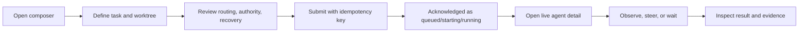
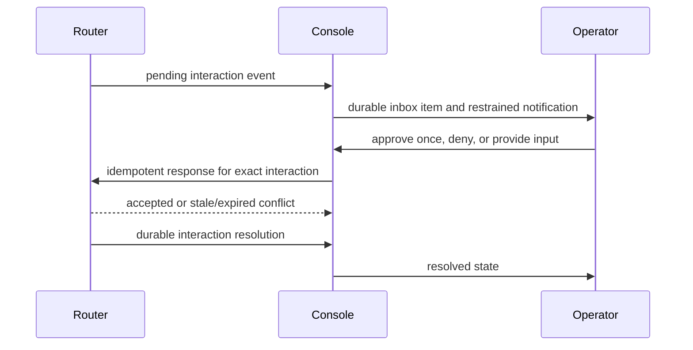
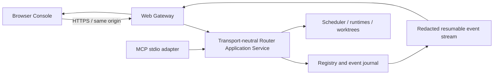

# Codex Router Console

## Web UI Product Requirements Document

| Field | Value |
| --- | --- |
| Status | Implementation-ready draft |
| Version | 0.1 |
| Date | 2026-08-13 |
| Product | Codex Router Console |
| Parent product | Codex Router |
| Primary users | Local operators, reviewers, and administrators |
| Primary form factor | Responsive desktop-first web application |
| Aesthetic authority | Emil Kowalski design-engineering principles |
| Required accessibility | WCAG 2.2 AA |

## 1. Executive summary

Codex Router Console is the complete operator-facing web interface for Codex Router. It turns the durable agent registry, runtime fleet, event journal, worktree leases, pending interactions, routing decisions, and evidence-backed results into one precise operational workspace.

The Console is not a chat skin over an MCP server and not a decorative monitoring dashboard. It is a stateful control surface for work that may run for minutes or hours, survive process restarts, move across runtime incarnations, require human approval, and mutate real repositories. The interface must make those semantics legible without flattening them into a misleading online/offline badge or an unbounded transcript.

Every lifecycle capability exposed by the router must have a safe and comprehensible UI path:

- Start an agent without blocking for completion.
- Observe current state and ordered history.
- Filter and compare many concurrent agents.
- Steer an active turn with stale-turn protection.
- Continue a completed or interrupted agent on its existing thread.
- Cancel work while preserving event-confirmed terminal semantics.
- Approve or deny one pending interaction within the original authority envelope.
- Perform clean or explicitly authorized unclean handoff.
- Inspect runtime health, quota, capacity, routing, worktree leases, and fencing.
- Read versioned results with worker claims separated from observed evidence.
- Diagnose recovery, disconnection, duplicate suppression, and event lag.
- Configure runtimes and router policy without revealing or accepting raw secrets.

The central UX invariant is:

> The interface may simplify presentation, but it must never simplify away authority, identity, evidence, or uncertainty.

The aesthetic direction is a **quiet operations desk**: calm, dense, tactile, and exact. It must feel crafted rather than themed. Beauty comes from excellent defaults, hierarchy, typography, responsiveness, and invisible edge-case correctness—not from decorative gradients, glass panels, or constant motion.

## 2. Relationship to the core PRD

This document is additive to [PRD.md](PRD.md).

- `PRD.md` remains authoritative for router lifecycle, durability, security, routing, recovery, and evidence semantics.
- This document is authoritative for the Web Console product surface, browser transport, interaction behavior, visual system, accessibility, and UI release gates.
- When the documents overlap, the stricter safety or correctness requirement wins.
- The Web Console must call the same transport-neutral application service used by MCP. It must not reimplement lifecycle state machines in the browser or invoke the router through its own stdio MCP process.
- A UI label, animation, cached projection, or optimistic state can never override durable router state.

Normative terms such as **must**, **must not**, **required**, and **release blocker** define acceptance requirements. **Should** describes a strong default that may be changed only with documented evidence.

## 3. Problem statement

The MCP interface is optimized for machine orchestration. It is intentionally compact, asynchronous, and transcript-sparing. Human operators still need to answer questions that are difficult to resolve through individual tool calls:

- Which agents are running, queued, blocked, handing off, or stale?
- Which runtime owns the active turn, and why was it selected?
- Is a task waiting for a human decision or simply still working?
- Does a completed result contain observed evidence or only a worker claim?
- Which worktree has a writer lease, and what fencing token protects it?
- Did a cancel request merely get accepted, or did the runtime confirm interruption?
- Did the browser lose events during reconnect?
- Is a runtime limited, degraded, draining, or truly offline?
- Can an agent safely continue, or does it require explicit handoff?
- Which configuration or operator action changed the system?

A generic admin template would create new failure modes:

- Showing stale projections as current.
- Treating command acceptance as terminal success.
- Hiding incarnation changes behind one avatar or chat thread.
- Mixing worker report with independently observed evidence.
- Replaying a mutation after a browser retry without a stable idempotency key.
- Exposing raw credentials, secret paths, hidden reasoning, or unbounded logs.
- Using color alone to communicate high-risk status.
- Animating frequently used controls until the console feels slow.
- Making approval or handoff actions look equivalent to harmless navigation.

The product needs a purpose-built operator experience whose interaction model follows the router's real domain.

## 4. Product vision

An operator opens the Console and understands the fleet within five seconds:

- The top-level health of the router and runtime pool.
- How many agents are active and how many need attention.
- Whether any worktree has a lease or recovery anomaly.
- Whether data is live, reconnecting, or stale.

From there, the operator can move from fleet to agent to evidence without losing context. High-frequency navigation is instant and keyboard-first. Risky actions reveal consequences before commitment. State changes arrive quietly and remain auditable. The interface does not celebrate routine success or dramatize normal activity; it gives confidence through clarity.

The target experience combines:

- The information density of an expert operations tool.
- The keyboard immediacy of a command launcher.
- The visual restraint of a well-made native utility.
- The traceability of an audit system.
- The safety semantics of the underlying router.

It must have its own identity and must not imitate a specific commercial product.

## 5. Goals and success definition

### 5.1 Product goals

1. Expose the complete router lifecycle without requiring manual MCP calls.
2. Make agent, incarnation, runtime, thread, turn, worktree, and result identity visibly distinct.
3. Surface human attention within one durable inbox.
4. Preserve event order and recover from browser disconnects without silent gaps.
5. Make reported claims and observed evidence impossible to confuse.
6. Provide safe, idempotent mutations with clear stale-state conflicts.
7. Make runtime load, quota, health, and routing reasons understandable at a glance.
8. Support full operator workflows on desktop and safe intervention from mobile.
9. Ship a cohesive visual and motion system with excellent defaults.
10. Meet WCAG 2.2 AA and remain usable with keyboard, screen reader, zoom, reduced motion, high contrast, and coarse pointer input.
11. Keep secrets, raw credentials, and hidden model reasoning out of the browser.
12. Provide deterministic acceptance tests for behavior, visuals, accessibility, performance, security, and recovery.

### 5.2 Success definition

The Console succeeds when an authorized operator can start, observe, intervene in, recover, and verify every router-managed task without using the MCP interface directly and without losing any safety or evidence semantics.

### 5.3 Release-level success metrics

- 100% of existing lifecycle tools have a tested UI path.
- 100% of mutating UI requests carry a stable idempotency key.
- 0 silent event gaps after reconnect in integration and chaos tests.
- 0 cases where accepted cancellation is presented as confirmed interruption.
- 0 cases where worker-reported tests are styled as observed tests.
- 0 credential or configured secret value reaches browser payloads, client logs, analytics, screenshots, or error telemetry.
- 100% of critical workflows pass keyboard-only and screen-reader acceptance.
- 0 serious or critical automated accessibility violations on required routes.
- p95 durable-state-to-visible-state latency below 750 ms on a healthy local connection.
- p75 Interaction to Next Paint below 200 ms on the reference hardware profile.
- All required viewports pass visual regression and functional acceptance.

## 6. Non-goals

The Web Console will not:

- Replace MCP as the parent-agent control interface.
- Become a general-purpose chat client.
- Display hidden chain-of-thought or private model reasoning.
- Stream every terminal byte or unbounded runtime transcript by default.
- Infer successful work from optimistic browser state.
- Provide a visual workflow-builder or DAG language in this release.
- Add multi-tenant billing, organization management, or public SaaS hosting.
- Copy, reveal, store, rotate, or accept raw provider credentials.
- Bypass provider limits, account policy, repository authority, or branch protection.
- Automatically approve commands or user-input requests.
- Automatically retry a failed mutation under a new idempotency key.
- Queue mutating operations while the browser is offline.
- Replace dedicated Git review tools; bounded diffs are evidence previews, not a full code-review environment.
- Add decorative agent avatars, anthropomorphic presence, confetti, or game-like fleet scoring.

## 7. Users, roles, and jobs to be done

### 7.1 Operator

The default local user who supervises active work.

Primary jobs:

- Start agents with explicit task, worktree, routing, authority, and recovery policy.
- Monitor current work without reading full transcripts.
- Respond to pending approvals and requested input.
- Steer, continue, cancel, or hand off when conditions change.
- Verify completion using observed files, Git state, and test evidence.
- Diagnose runtime health and queue pressure.

### 7.2 Reviewer

A read-only user who validates execution and evidence.

Primary jobs:

- Inspect agent history, routing decisions, checkpoints, and result versions.
- Compare reported conclusions with observed evidence.
- Deep-link to a stable agent, event, result, or incarnation view.
- Export a redacted audit summary.

### 7.3 Administrator

The person responsible for router configuration and runtime registration.

Primary jobs:

- Add, edit, enable, disable, drain, and reconnect runtime profiles.
- Configure allowed worktree roots and router policies.
- Validate and apply configuration changes atomically.
- Confirm that secret references resolve without seeing their values.
- Inspect security, retention, compatibility, and diagnostic state.

### 7.4 Role matrix

| Capability | Viewer | Operator | Administrator |
| --- | --- | --- | --- |
| Read agents, runtimes, events, results | Yes | Yes | Yes |
| Start, steer, continue, cancel, handoff | No | Yes | Yes |
| Resolve pending interaction | No | Yes, within task authority | Yes, within task authority |
| Export redacted audit summary | Yes | Yes | Yes |
| Change runtime or router configuration | No | No | Yes |
| View raw debug payloads | No | No | Yes, redacted and audited |

The local single-user mode may grant the administrator role, but authorization must still be enforced by the server. Hiding a button is not access control.

## 8. Product principles and UI invariants

### 8.1 Durable state wins

The UI renders durable server projections. Local optimistic state may communicate request progress but may not fabricate a lifecycle transition.

### 8.2 Identity stays separated

Every agent detail page must show the logical agent ID independently from its active incarnation, runtime, thread, turn, worktree, and result version. Copy actions must label exactly which identifier they copy.

### 8.3 Command acceptance is not completion

- Start acknowledgement means accepted or durably queued, not finished.
- Cancel acknowledgement means `cancelling`, not `interrupted`.
- Steer acknowledgement means delivered, not obeyed.
- Handoff acknowledgement identifies the new incarnation; it does not imply equivalent conversation continuity.

### 8.4 Evidence remains explicit

Worker-authored claims and router-observed evidence must appear in separate visual regions with explicit headings. An absent observation must display as **Not observed**, never as an empty success state.

### 8.5 Attention is first-class

Approvals, requested input, unsafe handoff, lost incarnation, and recovery conflicts must enter a durable attention inbox. Toasts may announce attention, but a dismissed toast cannot dismiss the underlying item.

### 8.6 No blind replay

The browser retains each mutation's idempotency key until a final response is known. A network retry reuses the key and payload. A changed payload requires a new user action and key.

### 8.7 Live state is honest

The shell always displays one of `Live`, `Reconnecting`, `Stale`, or `Offline`. Mutations are disabled when the client cannot establish current state. No green live indicator may be inferred from a recently cached snapshot.

### 8.8 Progressive disclosure, not hidden capability

The most common fields are immediately visible. Advanced routing, authority, recovery, identity, and debug details may be collapsed, but they remain discoverable and keyboard accessible.

### 8.9 Calm beats spectacle

The Console should feel fast because it responds immediately and avoids unnecessary motion. Status is communicated through structure, type, iconography, and restrained color—not constant pulsing or decorative animation.

### 8.10 Good defaults beat configuration volume

The default layout, density, motion, theme, polling behavior, and result presentation must be excellent without customization. Settings are added only for meaningful operator needs.

## 9. Domain presentation model

### 9.1 Agent statuses

The UI supports every current logical status:

| Status | Human label | Meaning | Visual treatment |
| --- | --- | --- | --- |
| `queued` | Queued | Durable but waiting for allocation/capacity | Neutral clock icon |
| `starting` | Starting | Runtime/thread/turn acceptance in progress | Blue progress glyph, no pulsing container |
| `running` | Running | Active regular turn | Blue activity glyph and text |
| `needs_attention` | Needs attention | Human decision or recovery action required | Amber badge and inbox count |
| `cancelling` | Cancelling | Interrupt requested; terminal state unconfirmed | Amber stop-progress glyph |
| `handing_off` | Handing off | Old incarnation quiescing/checkpointing or new one starting | Indigo transfer glyph |
| `waiting_for_reset` | Waiting for reset | Affine runtime is limited and policy retains it | Amber clock with reset time when known |
| `completed` | Completed | Terminal completion confirmed | Green check |
| `failed` | Failed | Terminal failure confirmed | Red error glyph |
| `interrupted` | Interrupted | Terminal interruption confirmed | Gray stop glyph |

Color must never be the only differentiator. Labels remain visible at all standard densities.

### 9.2 Incarnation and runtime states

Incarnation history is a chronological sequence, not a hidden retry counter. Every entry shows runtime, thread/turn identifiers, terminal reason, checkpoint relationship, fencing token when applicable, and timestamps.

Runtime states use the router's exact vocabulary: `ready`, `busy`, `draining`, `limited`, `degraded`, and `offline`. A runtime can be healthy but busy; load and health must not collapse into one red/green indicator.

### 9.3 Result states

Results are versioned and show one of `completed`, `failed`, `interrupted`, or `partial`. The default result view contains:

- Worker report: summary, decisions, invariants, risks, and pending work.
- Observed evidence: runtime/model, base and head SHA, changed files, actual worktree status, test commands/outcomes, and terminal error.
- Unverified items.
- Incarnation history.

### 9.4 Time and freshness

- Relative time is used for scanning: `2m ago`, `resets in 18m`.
- Exact local timestamp with timezone appears on hover/focus and in detail views.
- The current registry version and last successful stream time are available in the connection popover.
- Stale data includes an explicit **Last updated** timestamp.

## 10. Information architecture

### 10.1 Route map

```text
/
├── overview
├── agents
│   ├── new
│   ├── monitor
│   └── :agentId
│       ├── activity
│       ├── result
│       ├── evidence
│       ├── incarnations
│       └── policy
├── attention
├── runtimes
│   └── :runtimeId
├── worktrees
│   └── :worktreeKey
├── events
│   └── :eventId
└── settings
    ├── runtimes
    ├── worktrees
    ├── policies
    ├── retention
    └── diagnostics
```

Routes are deep-linkable. Filters, sorting, selected result version, and active detail tab are encoded in the URL when doing so improves shareability and browser history. Secrets, task bodies, user input, and raw event payloads must never appear in URLs.

### 10.2 Primary navigation

The desktop rail contains:

1. Overview
2. Agents
3. Attention, with durable count
4. Runtimes
5. Worktrees
6. Events
7. Settings

The rail is 232 px expanded and 64 px collapsed. Collapse state persists locally. Icon-only navigation always has accessible labels and tooltips.

### 10.3 Global command palette

`Cmd/Ctrl+K` opens an instant, non-animated command palette with:

- Navigate to any primary route.
- Search agents by ID, task, project, label, worktree, or runtime.
- Start a new agent.
- Open the attention inbox.
- Trigger context-valid actions for the current agent.
- Copy exact identifiers.

Keyboard-initiated open and close must have zero animation. Commands unavailable in the current state remain discoverable but explain why they are disabled.

## 11. Global application shell

### 11.1 Header

The header contains:

- Current route title and optional breadcrumbs.
- Global search/command-palette trigger.
- Connection state.
- Router version and compatibility warning when relevant.
- Theme control using system preference by default.
- Current role/session menu.

### 11.2 Connection-state behavior

| State | Behavior |
| --- | --- |
| Live | No persistent success banner; a compact connection indicator is sufficient |
| Reconnecting | Non-blocking amber banner, current snapshot retained, mutations disabled |
| Stale | Persistent banner with last update time and manual refresh |
| Offline | Explicit offline view, cached reads labeled stale, no queued mutations |

On reconnection, the client resumes from its last registry version. If the server reports a retention gap, the client discards derived cache, fetches a fresh snapshot, and announces that state was resynchronized.

### 11.3 Notifications

- Toasts are reserved for mutation acknowledgement, recoverable failure, and newly created attention.
- Durable conditions remain represented in their owning screen after the toast disappears.
- Success toasts auto-dismiss and pause while the document is hidden or hovered.
- Error toasts remain until dismissed or resolved and include an operation ID.
- Repeated equivalent events coalesce rather than stacking dozens of toasts.

## 12. Screen requirements

### 12.1 Overview

The overview answers “What needs me now?” before “How much activity exists?”

Required regions:

1. **Attention strip** — pending approvals, requested input, unclean handoffs, lost incarnations, and configuration errors.
2. **Fleet summary** — active, queued, attention-blocked, terminal in the selected time range.
3. **Runtime capacity** — active/max concurrency, state, quota usage, reset time, event lag.
4. **Active agents** — the most recently updated non-terminal agents.
5. **Recent outcomes** — completed, failed, and interrupted agents with evidence availability.
6. **Lease anomalies** — expired, conflicting, or near-expiry writer leases; absent when healthy.

Requirements:

- Metrics are derived from server projections, not client-side sampling.
- No chart is shown without meaningful historical data. A single current value is rendered as a number or bar, not a fake time series.
- Clicking any aggregate applies an equivalent filter on the destination screen.
- A healthy overview remains visually quiet; success does not fill the page with green cards.

### 12.2 Agent list

The list is the main fleet-management surface.

Columns at desktop width:

- Status.
- Agent ID and task summary.
- Project/worktree and mode.
- Runtime/provider/model.
- Current duration or terminal age.
- Attention/checkpoint indicator.
- Last update.
- Context menu.

Capabilities:

- Filter by status, project, worktree, runtime, capability tier, and label.
- Combine filters and encode them in the URL.
- Search task summary and exact IDs. Free-text search remains session-local and is not placed in the URL.
- Sort by last update, creation time, duration, or status priority.
- Paginate or virtualize without losing keyboard focus.
- Select multiple agents for read-only comparison or wait-style monitoring.
- Save no hidden server-side view state in V1; a copied URL reproduces the view.

Row updates must not unexpectedly reorder the table while the user is reading it. New sort order is applied on explicit refresh, when the user is at the top and idle, or after a clear “Updates available” action.

### 12.3 Multi-agent monitor

The monitor is the human equivalent of `agent_wait` for a selected set of agents.

Capabilities:

- Select 1–100 visible agents from the list or by exact ID.
- Choose `any` or `all` completion logic.
- Choose wake conditions: terminal, needs attention, handoff, or any status change.
- Display the starting registry version and every agent's current satisfaction state.
- Remain open as a dedicated route or compact side panel while the operator navigates elsewhere.
- Announce the first satisfied condition without discarding the rest of the group.
- Copy a deep link containing agent IDs and non-sensitive monitor conditions; task text is excluded.

The browser normally evaluates the monitor from durable stream projections rather than holding one long HTTP request. On reconnect, it resumes from the monitor's last registry version and reevaluates all selected agents. A timeout, when the operator sets one, ends the notification window and returns the current state; it does not mark any agent failed.

### 12.4 Start-agent composer

The composer is one responsive page with progressive disclosure, not a slow multi-screen wizard.

Required sections:

1. **Objective** — task body and optional labels.
2. **Project and worktree** — project key, canonical path validation, write/read-only mode.
3. **Routing** — capability tier by default; preferred/allowed runtime, provider, and model under Advanced.
4. **Authority** — push, merge, deploy, and external-write permissions, all false by default.
5. **Recovery** — manual, wait for reset, or automatic clean handoff.
6. **Review** — concise summary of runtime constraints, authority, recovery, and worktree risk.

Requirements:

- The form obtains a client-generated idempotency key on first submit and reuses it for identical retries.
- Server-side canonical path and allowed-root validation is authoritative.
- Write mode visibly explains exclusive lease acquisition.
- Authority controls use explicit labels and consequences, never icon-only toggles.
- Advanced defaults remain visible in the review summary even if their controls are collapsed.
- Submission displays immediate pressed feedback, then an in-button pending state without layout shift.
- Successful acknowledgement routes to agent detail and labels the state accurately as queued, starting, running, or needs attention.
- Closing a dirty composer requires discard confirmation; drafts may be stored locally, never sent to analytics.

### 12.5 Agent detail

The agent detail page is the canonical human view of one logical agent.

#### Header

Shows:

- Human-readable task summary.
- Exact agent ID with copy action.
- Status and freshness.
- Project/worktree mode.
- Active runtime and incarnation.
- Context-valid primary action.
- Secondary action menu.

#### Activity tab

Displays a bounded, ordered timeline derived from normalized events:

- Router command.
- Routing decision.
- Thread/turn lifecycle.
- Semantic output availability, without hidden reasoning.
- Command start/completion with bounded redacted output.
- File change and diff update.
- Pending/resolved interaction.
- Runtime error/disconnect.
- Checkpoint and reconciliation.
- Terminal event.

Events are grouped by incarnation and turn. The timeline loads newest useful context first while retaining an explicit path to older events. Raw debug payloads are administrator-only, redacted, size-bounded, collapsed by default, and every access is audited.

#### Result tab

- Result-version selector.
- Worker report section.
- Observed evidence section.
- Unverified items section.
- Clear partial/failed/interrupted state.
- Copy/export redacted summary.

Reported and observed sections must differ in structure, label, and icon—not merely in color.

#### Evidence tab

- Base and head SHA with copy actions.
- Worktree status.
- Changed-file list.
- Observed test table with command, exit code, outcome, and summary.
- Bounded server-redacted diff preview when available.
- Terminal error class/message.

The UI must say **No observed tests** when no command evidence exists. It must never infer passing tests from a worker summary.

#### Incarnations tab

Shows each incarnation as a chronological rail with:

- Runtime and provider.
- Thread/turn IDs.
- Start/end time and duration.
- Terminal reason.
- Checkpoint quality and handoff reason.
- Fencing token for write mode.
- Reconciliation evidence.

Cross-runtime handoff is described as a new incarnation and new thread. The copy must never say “session migrated.”

#### Policy tab

Shows immutable task inputs and effective policy:

- Original task.
- Routing request and recorded selection reasons.
- Authority envelope.
- Recovery policy.
- Labels.
- Caller scope.
- Worktree mode.

### 12.6 Agent action dock

Context-valid actions appear near the agent header and remain available at narrow widths through a sticky bottom dock.

| Action | Valid logical states | Required safeguards |
| --- | --- | --- |
| Steer | `running` | Include expected incarnation and turn; stale conflict refreshes state |
| Continue | `completed`, `interrupted` | Include expected result version; preserve thread/runtime affinity |
| Cancel | `running`, `needs_attention` | Explain `cancelling` is intermediate; optional background-terminal inspection |
| Handoff | `running`, `needs_attention`, `failed`, `interrupted`, `waiting_for_reset`, `completed` | Explain new incarnation/thread; show checkpoint outcome; explicit unclean authorization |
| Respond | `needs_attention` with current pending interaction | Correlate exact interaction; no blanket approval |
| View result | Any state with a result version | Read-only |

Unavailable actions remain explainable. The client sends server identifiers as preconditions but relies on the server for final transition validation.

### 12.7 Attention inbox

The inbox combines all unresolved human decisions.

Each item shows:

- Kind: approval, user input, recovery, unclean handoff, lost incarnation, or configuration issue.
- Agent, runtime, project, and worktree.
- Redacted request summary.
- Original authority relevant to the decision.
- Age and expiration state.
- Exact available responses.

Approval behavior:

- Only **Approve once** and **Deny** are available for command approvals.
- The UI never offers “always approve.”
- Expired or already-resolved requests become read-only and explain the race.
- Approval content is rendered as plain text or sanitized structured fields, never unsanitized HTML.
- A response remains pending until the durable interaction resolution is observed.

User-input behavior:

- Input is correlated to one interaction.
- Large text shows a character count and respects the server limit.
- Browser drafts remain local and are erased after confirmed resolution.

### 12.8 Runtimes

The runtime fleet screen shows:

- Runtime ID, adapter, provider, and allowed models.
- Capability tiers and policy tags.
- Enabled state.
- Health state and initialization state.
- Active/max concurrency.
- Primary/secondary quota usage and reset times.
- Credit state when available.
- Event lag and last update.
- Current agents.
- Recent failure classes and routing rejection reasons when available.

Requirements:

- Unknown quota fields display as unknown, not zero.
- Sparse rate-limit updates preserve prior visible fields according to the server projection.
- Quota bars include numeric labels and accessible text.
- `draining`, `limited`, `degraded`, and `offline` remain distinct.
- Historical charts appear only after a durable history source is implemented.

Administrator actions:

- Enable/disable runtime.
- Enter or leave drain mode.
- Reconnect/reinitialize runtime.
- Validate configuration and compatibility.
- Inspect redacted connection errors.

Every mutation requires server authorization, idempotency, audit logging, and readback.

### 12.9 Worktrees and writer leases

The worktree screen shows:

- Canonical path and project key.
- Git branch, head/base SHA, and dirty status when observable.
- Read-only agents using the path.
- Current writer lease owner.
- Incarnation and fencing token.
- Lease expiry and renewal freshness.
- Background-terminal/checkpoint anomalies.

Requirements:

- Paths outside configured roots are never browsable.
- Home, filesystem root, credential directories, and other rejected broad roots cannot be added through the UI.
- A lease warning never offers a client-only “force unlock.” Recovery must use a server command that verifies and audits ownership.
- A path is copied only through an explicit action; it is not sent to analytics.

### 12.10 Event journal and audit

The event view is an operator audit tool, not a raw log firehose.

Capabilities:

- Filter by agent, incarnation, runtime, thread, turn, event type, time, and operation ID.
- Preserve append order and sequence numbers.
- Deep-link to a single event without exposing payload in the URL.
- Expand bounded redacted payloads.
- Jump to related agent, runtime, interaction, checkpoint, or result.
- Export a bounded redacted range with export metadata.

Default retention and truncation are visible. The UI must disclose when older events or output have expired.

### 12.11 Settings and configuration

Configuration management is part of the complete Console, not a hidden file-editing prerequisite.

Required sections:

- Runtime profiles.
- Allowed worktree roots.
- Wait, lease, idempotency, and retention policy.
- Default routing and recovery policy.
- Web bind/auth/session configuration summary.
- Protocol compatibility.
- Diagnostics and version information.

Security requirements:

- The UI accepts secret references such as `env:NAME`, never raw secret values.
- Resolution status is only `resolved`, `unresolved`, or `not checked`; resolved paths and values are not returned.
- Configuration edits use a redacted structured form and a redacted diff.
- Save requires an expected configuration version.
- Validate and apply are separate steps.
- Apply is atomic, audited, and read back.
- Failed apply preserves the last valid configuration and provides a rollback result.
- Changes requiring runtime reconnect clearly identify affected runtimes before apply.

### 12.12 Diagnostics

Diagnostics expose:

- Registry version.
- Agents by status.
- Events by type.
- Duplicate-suppression and recovery counters.
- Runtime summaries.
- Writer leases.
- Pending interactions.
- Stream health, client count, and retained cursor boundary.
- Router build/version and protocol compatibility.

Diagnostics must not include credentials, environment values, secret paths, raw prompts, or hidden reasoning.

### 12.13 First-run and compatibility states

The first run is a real product state, not a broken empty dashboard.

- If no runtime exists, the overview explains the dependency and links an administrator to runtime configuration.
- If runtimes exist but none are eligible, the composer explains the rejected constraints before submission when the server can determine them.
- If the Web Console and gateway schema versions are incompatible, the shell blocks mutations, keeps safe reads when possible, and identifies the required upgrade side.
- If the router protocol adapter is incompatible with an installed runtime, only that runtime is marked incompatible; the rest of the Console remains usable.
- Onboarding never asks for raw credentials. It asks for secret references and shows only resolution status.

## 13. Primary workflows

### 13.1 Start and supervise



The UI must never block the composer until task completion. It transitions to the durable agent immediately after acknowledgement.

### 13.2 Human attention



### 13.3 Cancellation

1. Operator opens Cancel.
2. Dialog identifies active turn and explains that confirmation requests interruption.
3. Operator optionally requests background-terminal inspection.
4. UI sends the current expected turn ID and stable idempotency key.
5. Accepted response renders `Cancelling`.
6. Only a terminal event/reconciliation renders `Interrupted`, `Completed`, or `Failed`.

### 13.4 Handoff

1. Operator selects a reason and optional target runtime.
2. UI explains that a new incarnation and usually a new thread will be created.
3. Router quiesces/reconciles the old incarnation and inspects terminals/worktree.
4. Clean checkpoint proceeds under policy.
5. Unclean checkpoint pauses in attention state and displays the exact failed cleanliness conditions.
6. Continuing with unclean state requires an explicit acknowledgement and a new authorized request with `allowUnclean: true`.
7. The resulting incarnation history remains visible as one logical agent.

### 13.5 Browser reconnect

1. Stream disconnects; shell changes to Reconnecting and disables mutations.
2. Client reconnects with the last durable registry version/event cursor.
3. Server replays retained changes or reports a gap.
4. On replay, the client deduplicates and applies ordered projections.
5. On gap, the client fetches a new snapshot before re-enabling mutations.

## 14. Visual direction: Quiet Operations Desk

### 14.1 Personality

The Console is:

- Calm, not sleepy.
- Dense, not cramped.
- Technical, not theatrical.
- Tactile, not skeuomorphic.
- Premium through precision, not ornament.
- Confident about known state and explicit about uncertainty.

### 14.2 Anti-patterns

The implementation must avoid:

- Purple-blue AI gradients.
- Glassmorphism, glowing borders, and blurred chrome.
- A dashboard made entirely of floating cards.
- Excessive rounded pills.
- Decorative charts with no decision value.
- Monospace for all copy.
- Constant status pulses or animated backgrounds.
- Generic robot/sparkle iconography.
- Huge marketing typography inside an operational tool.
- Low-contrast gray-on-gray hierarchy.
- `transition: all`.
- Entrances from `scale(0)`.
- `ease-in` for interactive UI.

### 14.3 Layout language

- Base spacing unit: 4 px; primary rhythm: 8 px.
- Main content uses the available viewport up to 1600 px before adding outer breathing room.
- Information regions use alignment, hairlines, and surface tone before shadow.
- Cards are reserved for self-contained summaries; tables and split panes carry dense operational data.
- Floating surfaces use one restrained shadow family.
- Radius scale: 6 px controls, 10 px panels, 14 px dialogs; circles only for icon buttons/avatars where semantically appropriate.
- Critical actions remain visually separated from routine primary actions.

### 14.4 Typography

- Primary: self-hosted Geist Sans variable or an equivalently legible variable sans, with system fallback.
- Technical: self-hosted Geist Mono or an equivalent mono for IDs, SHAs, paths, commands, durations, and numeric metrics.
- No font asset may require a third-party runtime request.
- Tabular numerals are required for counters, quotas, timestamps, and durations.

Type scale:

| Token | Size / line-height | Use |
| --- | --- | --- |
| `display-sm` | 28 / 34 | Route-level metric or empty-state headline |
| `heading-lg` | 20 / 28 | Page title |
| `heading-md` | 16 / 24 | Section title |
| `body` | 14 / 21 | Default interface copy |
| `body-sm` | 13 / 19 | Dense tables and metadata |
| `label` | 12 / 16 | Labels and badges; never long prose |
| `code` | 12 / 18 | Identifiers, commands, paths |

### 14.5 Color system

The exact production values may be tuned during contrast testing, but the semantic roles and restrained character are locked.

| Role | Light | Dark |
| --- | --- | --- |
| Canvas | `#F4F4F1` | `#0E1012` |
| Surface | `#FFFFFF` | `#15181B` |
| Subtle surface | `#ECEDE9` | `#1D2125` |
| Primary text | `#17191C` | `#F2F4F1` |
| Muted text | `#62676F` | `#A5ABB3` |
| Hairline | `#D9DCD7` | `#2B3035` |
| Accent | `#315AEF` | `#7692FF` |
| Success | `#177A52` | `#58C58F` |
| Warning | `#925600` | `#E0A84B` |
| Danger | `#B4233C` | `#F06F82` |
| Info | `#2967C8` | `#70A5F3` |

Requirements:

- Text/background combinations pass WCAG 2.2 AA contrast.
- Focus rings pass 3:1 non-text contrast against adjacent colors.
- Semantic foreground/background pairs are tested independently in both themes.
- Color is always paired with label, icon, pattern, or position.
- Functional surfaces use solid colors; gradients are not part of the application chrome.

### 14.6 Iconography

- Use one coherent outline icon family with approximately 1.5–1.75 px optical stroke at common sizes.
- Default sizes are 16 px in dense controls, 18–20 px in navigation, and 24 px only for empty states or primary summaries.
- Icons align optically with adjacent text and use rounded joins only when consistent with the family.
- Sparkles, robots, magic wands, and emoji are not generic substitutes for product concepts.
- Custom domain icons for incarnation, handoff, fencing, and evidence must be tested at 16 px and remain distinguishable without color.

## 15. Component requirements

### 15.1 Pressable controls

- Buttons and icon buttons provide immediate pressed feedback using `scale(0.97–0.98)` for pointer activation.
- Press transitions target `transform` explicitly and finish in 100–140 ms.
- Disabled controls retain readable labels and expose a reason through adjacent copy or an accessible tooltip.
- Loading state preserves control width and label context.
- Destructive styles are reserved for actions that terminate or irreversibly alter state.

### 15.2 Popovers and tooltips

- Popovers transform from their trigger using the resolved transform origin.
- Entry starts at no less than `scale(0.97)` with opacity; never `scale(0)`.
- The first tooltip has a short intent delay; adjacent tooltips open instantly and without repeated animation while tooltip mode is active.
- Escape closes the topmost surface and restores focus to its trigger.

### 15.3 Dialogs and drawers

- Dialogs remain centered and use centered transform origin.
- Desktop uses dialogs for focused confirmation and side panels for inspect-with-context.
- Mobile uses bottom sheets for contextual actions and full-screen pages for long forms.
- Drag-to-dismiss is permitted only where accidental dismissal cannot lose submitted data or confirm a mutation.
- Dirty forms resist gesture dismissal and request confirmation.
- A draggable drawer captures the active pointer, ignores secondary touch points, applies damping beyond its natural boundary, and supports velocity-based dismissal.
- Gesture motion uses an interruptible spring with subtle or zero bounce; functional content never rubber-bands excessively.

### 15.4 Tables and lists

- Sticky headers preserve context.
- Row focus is visible independently from row selection.
- Columns collapse by priority at narrow widths rather than shrinking into illegibility.
- Virtualization preserves screen-reader and keyboard behavior or is disabled below the threshold where it is needed.
- Live updates do not steal focus or move the focused row.

### 15.5 Status badges

- Status badges contain icon and text.
- Badges do not animate continuously.
- Unknown and stale are explicit first-class states.
- Tooltip definitions explain router vocabulary without replacing the visible label.

### 15.6 Quota and capacity

- Bars include a value label and reset time.
- Unknown is visually distinct from 0%.
- 80% and 95% thresholds may change emphasis, but no threshold silently changes runtime state in the UI.
- Screen-reader text reads value, window, and reset time in one phrase.

### 15.7 Timeline

- Each item shows event type, concise consequence, exact time, and correlation context.
- Repeated noisy events may be visually grouped but never dropped from the audit count.
- Expansion is stable and does not collapse when new events arrive.
- New items appear without replaying entrance motion across the full list.

### 15.8 Empty, loading, and error states

- Empty states explain what the screen represents and provide one relevant next action.
- Initial loading uses stable skeleton geometry; perpetual shimmer is avoided.
- Partial failure keeps successful regions available and identifies failed regions.
- Every actionable error includes a human message, machine code, operation ID, and safe retry behavior.

## 16. Motion and interaction specification

Motion follows the Emil design-engineering framework: first decide whether motion should exist, then require a purpose, appropriate easing, and frequency-aware duration.

### 16.1 Motion tokens

```css
--ease-out: cubic-bezier(0.23, 1, 0.32, 1);
--ease-in-out: cubic-bezier(0.77, 0, 0.175, 1);
--ease-drawer: cubic-bezier(0.32, 0.72, 0, 1);

--duration-instant: 0ms;
--duration-press: 120ms;
--duration-tooltip: 140ms;
--duration-popover: 180ms;
--duration-dialog: 220ms;
--duration-drawer: 260ms;
```

### 16.2 Motion matrix

| Interaction | Frequency | Behavior | Purpose |
| --- | --- | --- | --- |
| Keyboard navigation/palette | Very high | No animation | Preserve immediacy |
| Button press | High | `scale(0.98)`, 120 ms ease-out | Input acknowledgement |
| Hover/focus color | High | 120–160 ms `ease` | State feedback |
| Tooltip | Frequent | 140 ms first; instant subsequent | Explain without slowing scanning |
| Popover/menu | Occasional | Opacity + `scale(0.97→1)`, 180 ms ease-out, trigger origin | Spatial continuity |
| Dialog | Occasional | Opacity + `scale(0.98→1)`, 220 ms ease-out, centered | Prevent jarring modal change |
| Mobile drawer | Occasional | Translate by own height, 260 ms drawer curve | Spatial continuity |
| Toast | Occasional | Transform + opacity; faster exit than entry | Feedback and dismiss direction |
| Tab selection | Frequent | Crisp color/underline transition, no page slide | State indication |
| Live table update | Very high | Color/opacity emphasis only; no reorder animation | Preserve reading position |
| Rare first-run empty state | Rare | Optional 30–60 ms stagger, never blocks input | Orientation |

### 16.3 Motion rules

- Interactive UI motion remains below 300 ms.
- `ease-in` is forbidden for entrances and direct feedback.
- Only `transform`, `opacity`, and carefully justified `clip-path` animate in normal UI.
- `transition: all` is forbidden.
- Rapidly retargeted UI uses CSS transitions, not restart-prone keyframes.
- Predetermined transitions prefer CSS; dynamic gestures may use WAAPI or springs when interruptibility requires them.
- JS animation shorthand that drops frames under load is not accepted for critical navigation.
- Stagger never blocks interaction and is limited to rare/first-run content.
- Exit is equal to or faster than entry.
- Motion is reviewed in slow motion, frame by frame, and under CPU load.

### 16.4 Reduced motion

With `prefers-reduced-motion: reduce`:

- Position, scale, parallax, and drag-settle motion is removed.
- Useful opacity and color transitions may remain at or below 200 ms.
- No information, ordering, or affordance depends on animation.
- Connection and loading state remains understandable without spinning or pulsing.

## 17. Responsive behavior

The Console is desktop-first but functionally complete across supported widths.

| Range | Layout |
| --- | --- |
| `>= 1280 px` | Expanded/collapsible rail, dense tables, optional detail split pane |
| `768–1279 px` | Collapsed rail, fewer visible columns, route-level details |
| `< 768 px` | Bottom navigation for primary areas, card/list transformation, full-screen forms, sticky action dock |

Requirements:

- No required lifecycle action disappears on mobile.
- Dense tables become prioritized records with expandable metadata.
- Long IDs and paths truncate visually but remain copyable and accessible in full.
- Touch targets are at least 44×44 CSS px where possible and never below WCAG target-size requirements without an allowed exception.
- Hover-only functionality is forbidden; hover effects are gated behind `(hover: hover) and (pointer: fine)`.
- Layout remains usable at 200% browser zoom and 320 CSS px width.
- Safe-area insets are respected for mobile bottom actions.

## 18. Accessibility requirements

### 18.1 Keyboard

- Every action is reachable without a pointer.
- Focus order follows visual order.
- Focus is never lost on route changes, live updates, dialog close, or virtualized-list updates.
- Skip links reach navigation, main content, and attention.
- Arrow-key patterns follow established ARIA behavior only for components that implement the full pattern.
- Shortcuts never override common browser or assistive-technology commands.

### 18.2 Screen reader

- Route changes announce page title.
- Status changes use a polite live region; critical attention may use assertive announcement sparingly.
- Streaming events do not announce every event by default.
- Tables, timelines, tabs, dialogs, menus, and comboboxes use correct semantics and names.
- IDs, SHAs, and paths have human labels before machine values.
- Icon-only controls have explicit accessible names.

### 18.3 Visual access

- WCAG 2.2 AA contrast is required in both themes.
- Focus is visible in forced-colors and high-contrast modes.
- Status never relies on color alone.
- Text remains legible at 200% zoom and with increased text spacing.
- Reduced transparency is naturally supported because core chrome does not rely on translucent glass.

### 18.4 Input and cognition

- Validation messages are adjacent to fields and summarized on submit.
- Destructive confirmation names the exact agent/runtime/worktree affected.
- Timeouts never erase user-entered text.
- Long forms use clear sections and a review summary.
- Technical terms have concise inline definitions without replacing precise domain vocabulary.

## 19. Content design

### 19.1 Voice

Copy is concise, direct, calm, and technically honest.

Use:

- “Cancellation requested. Waiting for terminal confirmation.”
- “No observed test command.”
- “A new incarnation will start on runtime `sol-review`.”
- “State is stale. Reconnect before sending commands.”

Avoid:

- “Agent killed!”
- “Everything looks great.”
- “Tests passed” when only reported by a worker.
- “Session migrated” for a checkpoint-based handoff.
- “Something went wrong” without an error code or next action.

### 19.2 Truncation

- Task summaries may be generated deterministically from the first meaningful line; the full task remains accessible.
- Machine identifiers use middle truncation visually and copy in full.
- Error messages preserve the actionable clause before truncation.
- Bounded output discloses truncation and original/retained byte count when known.

## 20. Browser transport and server architecture

### 20.1 Component model



Requirements:

- Web and MCP are adapters over the same application service.
- The browser never connects directly to SQLite, App Server, provider workers, or secret storage.
- Server responses pass through the same early redaction boundary as MCP responses and logs.
- Browser-facing DTOs are versioned independently from internal database rows.
- The gateway can be disabled for MCP-only installations.

### 20.2 Required API surface

The exact URL structure may change in technical design, but equivalent versioned capabilities are required.

#### Bootstrap and reads

```text
GET  /api/v1/bootstrap
GET  /api/v1/agents
GET  /api/v1/agents/:agentId
GET  /api/v1/agents/:agentId/events
GET  /api/v1/agents/:agentId/results
GET  /api/v1/agents/:agentId/results/:version
GET  /api/v1/agents/:agentId/evidence
GET  /api/v1/interactions
GET  /api/v1/runtimes
GET  /api/v1/runtimes/:runtimeId
GET  /api/v1/worktrees
GET  /api/v1/events
GET  /api/v1/diagnostics
GET  /api/v1/config
```

#### Agent mutations

```text
POST /api/v1/agents
POST /api/v1/agents/:agentId/steer
POST /api/v1/agents/:agentId/continue
POST /api/v1/agents/:agentId/cancel
POST /api/v1/agents/:agentId/handoff
POST /api/v1/interactions/:interactionId/respond
```

#### Administration

```text
POST /api/v1/config/validate
PUT  /api/v1/config
POST /api/v1/runtimes/:runtimeId/enable
POST /api/v1/runtimes/:runtimeId/disable
POST /api/v1/runtimes/:runtimeId/drain
POST /api/v1/runtimes/:runtimeId/reconnect
```

#### Realtime

```text
GET /api/v1/stream?afterVersion=<registryVersion>
```

Server-Sent Events are the default because updates are server-to-browser and lifecycle mutations remain explicit HTTP commands. A WebSocket may replace SSE only if it preserves cursor resume, ordering, backpressure, authentication, and testability.

### 20.3 Mutation contract

Every mutation includes:

```ts
type WebMutationMeta = {
  idempotencyKey: string;
  expectedRegistryVersion?: number;
  expectedIncarnationId?: string;
  expectedTurnId?: string;
  expectedResultVersion?: number;
};
```

Only fields supported by the corresponding router command are forwarded. Generic expected-version checks may be added server-side but must not weaken the command's existing preconditions.

Response rules:

- `200` for completed read or idempotent replay.
- `202` for an accepted asynchronous mutation.
- `400/422` for invalid input.
- `401/403` for authentication/authorization failure.
- `404` for invisible or absent resources.
- `409` for stale turn/incarnation/result/configuration or invalid transition.
- `429` for gateway-level request limiting, never for provider quota projection.
- `503` for unavailable router service.

Errors use a stable envelope:

```ts
type WebError = {
  error: {
    code: string;
    message: string;
    details?: Record<string, unknown>;
    operationId: string;
    retryable: boolean;
  };
};
```

### 20.4 Event-stream contract

- Each message contains event ID, registry version or journal sequence, event type, redacted payload summary, and correlation identifiers.
- Delivery is at least once; the client deduplicates by stable event ID/sequence.
- Order is monotonic within one router registry stream.
- Keepalives contain no sensitive state.
- The server exposes the oldest resumable cursor.
- A cursor older than retention produces an explicit gap response that forces snapshot resynchronization.
- Slow clients receive bounded buffers and a resync instruction rather than unbounded memory growth.
- Client state is periodically reconciled from projections instead of trusting an infinite patch chain.

## 21. Data consistency and client-state rules

- Server projections are canonical.
- Query cache entries are keyed by stable identity and result version.
- Mutations do not optimistically change lifecycle status beyond a local “request sending” affordance.
- A successful response may update the returned projection but remains subject to the next durable stream/readback.
- Browser retries reuse the exact serialized payload and idempotency key.
- A stale conflict refreshes the affected resource before offering another action.
- No mutation is automatically retried after a semantic `409`, `403`, or non-retryable `5xx` response.
- Background tabs may reduce rendering work but must resume from the last durable cursor.
- Multiple tabs may share a stream when practical, but correctness must not depend on cross-tab coordination.

## 22. Security and privacy

### 22.1 Network defaults

- Web mode binds to loopback by default.
- Non-loopback binding requires explicit configuration and a production authentication mode.
- Plain HTTP is accepted only on loopback.
- Remote access requires TLS at the gateway or a documented trusted reverse proxy.
- CORS is disabled by default; allowed origins are explicit and exact.

### 22.2 Authentication and sessions

The local launch flow should use a short-lived one-time bootstrap token:

1. `codex-router web --open` starts or discovers the web gateway.
2. Browser receives a one-time token in the URL fragment, not query parameters.
3. The token is exchanged for an HttpOnly, Secure when applicable, SameSite=Strict session cookie.
4. The fragment is removed immediately with history replacement.

Remote deployments require a trusted identity provider or reverse-proxy identity with explicit role mapping. Static long-lived bearer tokens in local storage are forbidden.

### 22.3 Request protection

- Mutations validate Origin and CSRF protection.
- Sessions have idle and absolute expiry.
- Logout revokes the server session.
- Sensitive responses use `Cache-Control: no-store`.
- Content Security Policy disallows arbitrary script sources and unsafe evaluation.
- Clickjacking protection is enabled.
- Request bodies and exports are size-bounded.

### 22.4 Secret boundary

- Raw credentials and resolved credential paths never enter browser DTOs.
- Secret references may be shown only by symbolic name when policy permits.
- Redaction occurs before persistence and again before browser serialization as defense in depth.
- Client error reporting strips task text, user input, paths, commands, event payloads, and identifiers unless explicitly allowlisted.
- Clipboard actions are always explicit.

### 22.5 Content safety

- Worker/task/event content is untrusted text.
- Markdown, if supported, uses a strict sanitizer and disables raw HTML.
- Links require safe protocols and visually expose external destinations.
- ANSI output is parsed through an allowlisted renderer or displayed as plain text.
- File and diff content cannot execute scripts or load remote resources.

### 22.6 Audit

The server records:

- Authenticated actor/session and role.
- Operation ID and idempotency key hash.
- Command, target identity, request result, and durable registry version.
- Configuration validation, apply, rollback, runtime lifecycle, and export actions.

Audit records are redacted and never include raw credentials.

## 23. Performance and resilience

### 23.1 Performance budgets

- Initial shell JavaScript: target ≤ 250 KiB gzip, excluding locally hosted font files.
- Route-level code splits load diagnostics, diff viewer, and settings only when opened.
- LCP p75 ≤ 2.5 seconds on the reference throttled profile.
- INP p75 ≤ 200 ms.
- CLS ≤ 0.1.
- Warm route transition feedback begins within 100 ms.
- Live durable update becomes visible within 750 ms p95 on a healthy local connection.
- Scrolling remains responsive with 1,000 retained agents and 10,000 bounded event summaries.
- No normal UI animation exceeds 300 ms or drops below 55 fps on reference hardware under simulated stream load.

### 23.2 Resilience

- One failed panel does not blank the entire application shell.
- Route-level error boundaries preserve navigation and operation IDs.
- Stream disconnect does not discard the last good snapshot.
- Retention gaps trigger explicit snapshot recovery.
- Refreshing during a pending mutation recovers through idempotency and durable projection.
- Browser crashes do not create duplicate commands.
- Server restart shows reconnecting/stale state until reconciliation completes.

## 24. Observability and product analytics

### 24.1 Operational telemetry

Required browser/gateway metrics:

- Page and API latency by route/operation.
- SSE connections, disconnects, resumptions, gaps, and resync duration.
- Visible-state latency from durable event timestamp.
- Mutation acknowledgement, conflict, replay, and error counts.
- Client render errors and route-boundary failures.
- Long tasks, INP, LCP, CLS, and dropped-frame samples.
- Attention age and resolution duration.

### 24.2 Privacy-preserving analytics

Product analytics are off by default in local mode. If enabled:

- Events use coarse feature names and timing buckets.
- No task text, prompt/input, command, output, path, ID, SHA, label, event payload, or credential reference is collected.
- The settings screen lists exactly what is collected.
- Operators can export or delete local analytics state.

### 24.3 Correlation

Frontend errors and mutations include an operation ID that can be matched to gateway/router structured logs. Correlation must not require exposing secret-bearing payloads.

## 25. Functional acceptance criteria

### 25.1 Lifecycle parity

- An operator can execute all ten lifecycle operations and read diagnostics from the Console.
- Start returns to the agent detail page before the task completes.
- Agent list filters map to server-supported filters and survive reload.
- Steer sends current incarnation and turn preconditions.
- Continue is available only at a completed or interrupted boundary and retains runtime/thread affinity.
- Cancel remains `cancelling` until terminal confirmation.
- Handoff displays old/new incarnations and checkpoint quality.
- Result versions remain selectable after continuation.
- Pending interactions resolve only through exact correlation.

### 25.2 Concurrency and realtime

- At least 100 live agent projections can update without losing input focus or reordering the active row unexpectedly.
- A browser disconnect/reconnect cannot miss a terminal or attention state.
- Duplicate event delivery produces one visible event.
- A retention gap causes full resync and a visible notice.
- Two browser tabs issuing the same retained mutation key do not create duplicate router commands.

### 25.3 Evidence integrity

- Reported and observed data are structurally separated.
- No observed tests renders as such.
- Changed files and Git state come from server observation.
- Truncated evidence discloses truncation.
- Expired events/output disclose retention loss.
- Cross-runtime handoff never claims thread migration.

### 25.4 Safety

- Authority defaults are false in the composer.
- Browser state cannot broaden authority during continue or handoff.
- Unclean handoff requires a second explicit authorization after checkpoint inspection.
- Stale turn/incarnation/result/config versions fail closed with `409` and refreshed context.
- Mutations are unavailable while state is offline or stale.
- No offline mutation queue exists.

### 25.5 Security

- Automated fixtures prove credential-shaped values are redacted before browser serialization.
- XSS payloads in task, event, command, Markdown, ANSI, path, and error fields render inertly.
- CSRF, Origin, session expiry, role, CORS, CSP, clickjacking, and rate-limit tests pass.
- The default server is unreachable from non-loopback interfaces.
- Secret configuration accepts references only.
- No sensitive application data appears in URLs or analytics.

### 25.6 Accessibility

- All critical flows pass keyboard-only operation.
- Required routes pass screen-reader smoke tests.
- Automated checks report zero serious or critical violations.
- Light/dark semantic pairs pass contrast tests.
- Focus survives live updates, dialogs, drawers, routing, and virtualization.
- The product remains functional at 200% zoom, 320 CSS px width, forced colors, and reduced motion.

### 25.7 Visual and motion quality

- No functional screen resembles a generic AI landing page or stock card dashboard.
- Typography, spacing, surfaces, status, icons, and empty states are consistent across all routes.
- All pressable controls have immediate feedback.
- Popovers use trigger-aware origins; dialogs remain centered.
- No UI enters from `scale(0)`, uses `transition: all`, or uses `ease-in` for direct feedback.
- Keyboard-triggered frequent actions are instant.
- UI motion remains under 300 ms and is interruptible where repeatable.
- Reduced-motion behavior is verified, not inferred.
- Slow-motion, frame-by-frame, CPU-throttled, and physical touch-device reviews pass.

## 26. Verification strategy

### 26.1 Unit tests

- DTO parsing and redaction.
- Status-to-presentation mapping.
- Action-availability matrix.
- Idempotency-key retention across retry/reload.
- Stream deduplication, ordering, cursor, and gap logic.
- Reported/observed result separation.
- Role and authority rendering.
- Relative/exact time behavior.
- Reduced-motion decisions.

### 26.2 Component tests

- Composer validation and advanced-default review.
- Attention race: pending becomes expired before submit.
- Cancellation intermediate state.
- Clean and unclean handoff confirmation.
- Runtime unknown quota vs 0%.
- Virtualized list focus preservation.
- Dialog/popover focus restoration and Escape behavior.
- Toast pause/coalescing behavior.

### 26.3 Contract tests

- Every web mutation maps to the same application-service command and schema as MCP.
- Error-code/status mapping.
- Session/CSRF/Origin/role enforcement.
- Redacted DTO snapshots.
- SSE replay, keepalive, backpressure, retention gap, and reconnect.
- Configuration validate/apply/rollback and readback.

### 26.4 End-to-end tests

1. Start three agents with different runtimes/worktree modes.
2. Filter and monitor all three while events stream.
3. Steer the active Codex turn.
4. Resolve one approval and one user-input request.
5. Cancel another task and verify `cancelling` before `interrupted`.
6. Continue a completed task on the same thread.
7. Perform a clean handoff and inspect incarnation history.
8. Trigger an unclean handoff, verify the block, then explicitly authorize it.
9. Disconnect the browser stream during terminal completion and recover without a gap.
10. Inspect result versions, changed files, observed tests, and unverified claims.
11. Apply a validated runtime configuration change and verify audited readback.

### 26.5 Chaos and race tests

- Browser loses start response, reloads, and retries with the same key.
- Event arrives before mutation HTTP response.
- Interaction expires while its dialog is open.
- Agent completes while Cancel confirmation is open.
- Handoff changes incarnation while Steer form is open.
- Router restarts while browser is connected.
- Stream cursor falls outside retention.
- Two operators submit conflicting configuration versions.
- Slow client exceeds stream buffer.

### 26.6 Visual regression matrix

Required routes:

- Overview healthy, mixed, and attention-heavy.
- Agent list empty, dense, filtered, and live-updating.
- Composer default, validation failure, and advanced authority.
- Agent detail for every logical status.
- Result with full evidence, partial evidence, and no observed tests.
- Attention approval, user input, expired, and unclean handoff.
- Runtime ready, limited, degraded, offline, and unknown quota.
- Worktree clean, dirty, leased, and anomalous.
- Settings valid, invalid, applying, and rollback failure.

Each is captured in:

- Light and dark themes.
- 1440×900 desktop.
- 1024×768 tablet.
- 390×844 mobile.
- Reduced motion where state differs.
- Forced-colors smoke coverage.

### 26.7 Manual craft review

Before release, a reviewer must:

- Inspect all motion at 0.25× speed and frame by frame.
- Test rapid interruption/reversal of popovers, dialogs, drawers, and toasts.
- Run with CPU throttling and active event traffic.
- Test touch interactions on a physical phone.
- Review the product again after a cooling-off period with fresh eyes.
- Confirm that the aggregate experience feels cohesive rather than merely checklist-compliant.

## 27. Delivery phases

Phases sequence implementation; all are required for the release described by this PRD.

### Phase 0: Contract and design foundation

- Extract transport-neutral application service.
- Define versioned browser DTOs and redaction boundary.
- Build design tokens, typography, icons, motion primitives, and component harness.
- Prototype overview, agent list, detail, composer, attention, and runtime views with representative fixtures.
- Validate accessibility and visual direction before feature expansion.

Exit gate: reviewed interactive prototype, contract tests, and no unresolved core information-architecture decisions.

### Phase 1: Read-only live console

- Shell, navigation, command palette.
- Overview, agent list/detail, results/evidence, runtimes, worktrees, events, diagnostics.
- Authenticated gateway and resumable SSE.

Exit gate: accurate live read experience, reconnect recovery, and no secret-bearing DTOs.

### Phase 2: Lifecycle control

- Start, steer, continue, cancel, respond, and handoff.
- Stable idempotency and stale-state handling.
- Attention inbox and contextual action dock.

Exit gate: lifecycle parity tests and chaos/race suite pass.

### Phase 3: Administration

- Runtime management.
- Allowed roots and policy configuration.
- Validate/apply/rollback/readback.
- Role enforcement and audit export.

Exit gate: configuration failure cannot corrupt the last valid state or reveal secrets.

### Phase 4: Release hardening

- Performance budgets.
- Full accessibility audit.
- Visual regression matrix.
- Browser/device coverage.
- Security review and dependency audit.
- Documentation and operator onboarding.

Exit gate: every Definition of Done item is evidenced.

## 28. Dependencies

- Stable transport-neutral router application service.
- Durable registry and event journal.
- Versioned, redacted browser DTOs.
- Resumable event cursor with explicit retention boundary.
- Server-side authentication, role authorization, CSRF, and session management.
- Atomic validated configuration service with rollback/readback.
- Safe bounded evidence/diff retrieval.
- Accessible component primitives with trigger-aware positioning and reliable focus management.
- A browser automation stack, accessibility scanner, visual regression runner, and performance test harness.

Exact frontend framework, component primitive library, test runner, and bundler belong in the technical design. Their selection must satisfy this PRD rather than redefine it.

## 29. Risks and mitigations

| Risk | Impact | Mitigation |
| --- | --- | --- |
| UI duplicates router state logic | Divergent or unsafe transitions | One application service; server-authoritative action checks |
| Stream gap is missed | Operator sees stale/false state | Durable cursor, retention boundary, forced snapshot resync |
| Optimistic mutation misleads | False completion or unsafe next action | No optimistic lifecycle transitions; event-confirmed state |
| Dense UI becomes generic/noisy | Poor comprehension and low trust | Quiet operations desk direction; hierarchy and restraint gates |
| Motion harms speed | Repeated actions feel sluggish | Frequency framework; keyboard actions instant; <300 ms limit |
| Browser renders untrusted content | XSS or data exfiltration | Plain text by default, strict sanitizer/CSP, no remote content |
| Configuration UI leaks secrets | Credential exposure | References only, server redaction, no resolved path/value |
| Mobile hides capability | Operator cannot intervene safely | Full action parity with responsive reflow and sticky action dock |
| Live updates disrupt reading | Lost focus/context | Stable ordering, updates-available affordance, focus preservation |
| “Unknown” appears healthy | Unsafe routing decisions | First-class unknown/stale states, never coerce to zero/success |
| Visual regression suite fossilizes defects | False confidence | Human craft review plus snapshots, not snapshots alone |
| Admin actions exceed task authority | Unauthorized external effects | Role and original authority both enforced server-side |

## 30. Locked product decisions

1. The product is an operator console, not a chat interface.
2. The complete current MCP lifecycle has UI parity.
3. Web and MCP use one transport-neutral application service.
4. HTTP mutations plus resumable SSE are the default browser transport.
5. Server projections remain authoritative; browser state never fabricates lifecycle completion.
6. Logical agent, incarnation, runtime, thread, turn, worktree, and result identities remain visibly separate.
7. Reported claims and observed evidence are structurally distinct.
8. Cancellation remains intermediate until terminal confirmation.
9. Cross-runtime handoff is a new incarnation/thread, never presented as session migration.
10. Every mutation is idempotent and conflict-aware.
11. Offline mutations are disabled and never queued.
12. Raw credentials, secret values/paths, and hidden reasoning never reach the browser.
13. Web mode binds to loopback by default.
14. Runtime configuration accepts secret references only and applies atomically with readback.
15. The aesthetic is a quiet operations desk with restrained surfaces and semantic color.
16. High-frequency keyboard interactions do not animate.
17. UI motion is purposeful, interruptible where needed, and under 300 ms.
18. WCAG 2.2 AA is a release requirement, not post-release cleanup.
19. Desktop, tablet, and mobile retain complete operational capability.
20. A green local test run, hosted CI, accessibility audit, visual review, security review, and live runtime smoke remain separate evidence gates.

## 31. Intentionally deferred choices

These decisions require technical design or prototype evidence but may not weaken the locked product behavior:

- Exact TypeScript frontend framework and bundler.
- Exact accessible headless component primitive library.
- Exact icon set, provided it is visually coherent and tree-shakeable.
- Whether large lists use pagination, virtualization, or a hybrid at each route.
- Whether a shared worker coordinates streams across browser tabs.
- Exact self-hosted font files if the preferred font fails performance or language coverage.
- Optional historical runtime charts after a durable metrics history exists.
- Optional installable PWA shell; offline mutations remain forbidden.
- Remote authentication provider adapters beyond the required session/role contract.

## 32. Definition of Done

The Web Console is release-complete only when all of the following are true:

### Product

- Every required route and workflow exists.
- All router lifecycle capabilities have parity and traceability.
- No capability is silently removed at narrow viewports.
- Empty, loading, partial, stale, offline, error, and permission-denied states are designed.

### Correctness

- Durable state and cursor recovery are proven under restart and race conditions.
- No duplicate mutation occurs after response loss or browser reload.
- Cancellation, handoff, interaction, and evidence semantics match the core PRD.
- Local and browser DTO schemas are versioned and contract-tested.

### Design quality

- The complete visual regression matrix is approved.
- Motion passes Emil-derived review rules, slow-motion inspection, and reduced-motion verification.
- The product feels cohesive across typography, spacing, surfaces, interaction, and content.
- No known placeholder, stock-dashboard, or generic AI aesthetic remains.

### Accessibility

- WCAG 2.2 AA audit passes.
- Keyboard and screen-reader critical flows pass.
- Contrast, zoom, touch, forced colors, and reduced motion pass.

### Security

- Threat model and security review are complete.
- Auth, role, CSRF, Origin, CSP, CORS, session, XSS, and redaction tests pass.
- Secret scan and browser-payload inspection find no live credentials or secret values.

### Performance and operations

- Performance budgets pass on the reference profile.
- Hosted CI is green on the exact reviewed head.
- Production build/package artifacts are inspected.
- Operator documentation covers installation, local/remote security, recovery, and rollback.
- Live credential-backed runtime smoke is completed separately in an authorized environment.

No single automated score substitutes for this complete evidence set.

## 33. Capability traceability matrix

| Router capability | Primary UI | Evidence |
| --- | --- | --- |
| `agent_start` | Start-agent composer | Agent acknowledgement and activity timeline |
| `agent_status` | Agent detail header/policy | Durable projection and identifiers |
| `agent_list` | Agent list/overview | Filtered paginated projection |
| `agent_wait` | Multi-agent monitor/live stream | Cursor-based state changes; no model polling |
| `agent_steer` | Agent action dock | Router command event and current turn |
| `agent_continue` | Agent action dock/result | New turn on same runtime/thread |
| `agent_cancel` | Cancel dialog/action dock | `cancelling` then terminal event |
| `agent_handoff` | Handoff flow/incarnations | Checkpoint plus old/new incarnation |
| `agent_result` | Result/evidence tabs | Versioned reported and observed sections |
| `agent_respond` | Attention inbox | Exact interaction resolution |
| `router_diagnostics` | Overview/diagnostics | Registry, runtime, lease, event, and counter state |

This matrix is a release checklist. A capability is incomplete until its UI action, state behavior, failure handling, accessibility, security, and test evidence all exist.
